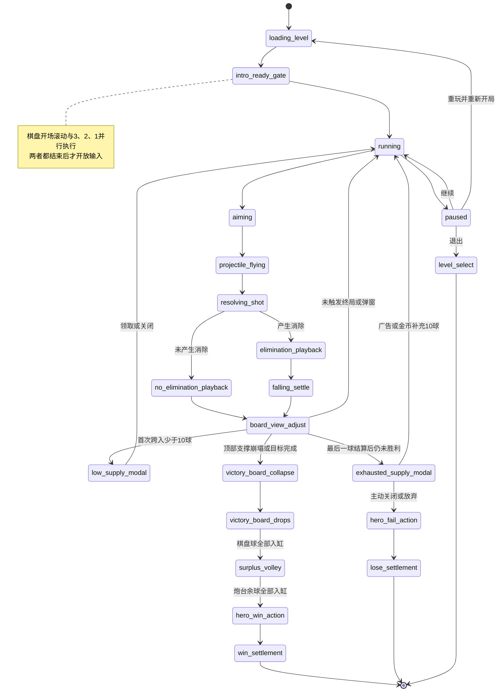

# 琉璃精灵泡泡玩法详细设计

> 文档状态：V1.4 详细设计稿（已增加新 UI 清单与生图提示词）  
> 日期：2026-06-20  
> 适用工程：Cocos Creator 2.4.9，`E:\coco_project\bubble`  
> 本文只定义目标玩法、数据契约和实施边界，不代表功能已经实现。

## 1. 设计目标

本次改造保留项目现有的蜂窝棋盘、发射吸附、三消、失去支撑掉落、缸体收集、特殊球和浮岛选关骨架，将局内核心体验改造成“清除顶部支撑—制造大面积坠落—借助琉璃精灵反弹—落缸倍率计分”的循环。

设计重点：

1. 去掉按发射次数强制下压棋盘的压迫机制，改为围绕 11 行可视棋盘自动滚动。
2. 强化玻璃球逐颗碎裂、悬空坠落、碰撞精灵、落缸计分的连续反馈。
3. 让局内主角精灵、可收集琉璃精灵、解救精灵和坏蛋精灵共享同一套世界观。
4. 把低剩余球、补球、胜负动作、余球抛射和弹道道具做成可验证的状态机，不靠 UI 延时猜测流程。
5. 沿用项目 Fail-Fast 原则：缺配置、缺节点、缺资源、非法状态直接报错，不添加默认值、静默跳过或旧逻辑兼容分支。

### 1.1 借鉴边界

可以借鉴经典泡泡消除产品的“发射—消除—坠落—底部接球—伙伴反弹加成”节奏，但角色名称、世界设定、美术造型、台词、关卡图案、音效和数值均使用本项目原创内容，不直接复刻《开心泡泡猫》的受保护素材与叙事表达。

### 1.2 模式适用范围

- 普通 `shot_limited` 关卡：应用本文全部棋盘、剩余球、补球、余球抛射与胜负流程。
- 特殊浮岛 `timed_infinite_shots` 关卡：应用棋盘滚动、消除、精灵碰撞和解救目标；不显示剩余球、不触发低球/零球补给、不执行炮台余球抛射。
- 随机挑战：复用普通关卡规则，但随机生成器必须同时满足“至少 7 行、顶部行填满、特殊实体合法”的新校验。

## 2. 世界观设计

### 2.1 世界背景

故事发生在漂浮于云海上的“琉璃浮岛群”。岛屿的能量来自会发光的琉璃球，琉璃球原本由精灵照看。反派“黯晶王”污染了岛心，把守护精灵封进球体，并用凝石魔法让浮岛逐层失去光芒。

“璃星公主”被困在浮岛群最深处。玩家操控引路精灵“米露”，利用琉璃炮台击碎污染球、解救小精灵，并沿特殊浮岛打开通向公主的逃离航路。

以上名称是可替换的工作名；更名只影响文案和资源命名，不改变系统规则。

### 2.2 角色与玩法映射

| 世界观对象 | 局内身份 | 玩法作用 |
|---|---|---|
| 米露（主角精灵） | 炮台旁的递球手 | 持有下一颗球，发射后把球装入炮台；负责胜利/失败动作 |
| 琉璃精灵 | 6 个场内协助位 | 被消除能量召唤，反弹坠落球并提高落缸倍率 |
| 被困小精灵 | 特殊球体 | 特殊关卡目标；打破封印或安全落缸即完成解救 |
| 凝石坏蛋精灵 | 棋盘特殊实体 | 被直接击中时固化周围球，制造短期障碍 |
| 巡行小兽 | 特殊动物球 | 被直接击中后沿预设方向跑过当前行，逐颗吃掉前方球 |
| 璃星公主 | 长线剧情目标 | 玩家通过特殊浮岛逐段解锁逃离路线 |
| 黯晶王 | 主反派 | 污染琉璃球、操纵坏蛋精灵、封锁特殊浮岛 |

### 2.3 浮岛推进结构

- 普通浮岛：清理琉璃污染，积累星星和精灵能量。
- 特殊浮岛：配置“解救小精灵”目标；完成后该精灵加入玩家的协助精灵池。
- 章节节点：每解救一组精灵，恢复一段逃离航路并推进公主剧情。
- 终章：已解救精灵共同稳定琉璃炮台，帮助公主离开黯晶核心岛。

为了保持严格数据契约，启用琉璃精灵玩法前，玩家协助池必须至少包含一只基础精灵；首关剧情直接授予基础精灵，协助池为空应报错，不能临时生成匿名精灵兜底。

## 3. 核心玩法循环

一次标准操作循环：

1. 玩家拖动瞄准；普通状态只显示发射方向的第一段直线。
2. 主角把手中球装入炮台，炮台发射当前球，主角取出下一颗球等待。
3. 球命中并吸附到蜂窝格。
4. 若形成三消，逻辑层立即完成消除判定；表现层按吸附点向外逐颗碎裂。
5. 失去顶部支撑的球进入坠落系统。
6. 本次有球消除、但没有产生任何悬空掉落时，从最后一颗消除球的位置召唤一只固定位置琉璃精灵；未产生消除时，最早入场的两只协助精灵离场；已经产生掉落时不生成新精灵。
7. 固定位置精灵分为红、黄、绿三色，碰撞加成依次提高；坠落球碰到绿色精灵时还会分裂为两个，并提高绿色精灵的表面光效层数。
8. 球进入底部缸口，按缸位基础分、颜色加成、精灵碰撞倍率和局内分数增益结算。
9. 根据棋盘实际占用行调整视口，使屏幕中上方尽量维持 11 行。
10. 检查顶部支撑崩塌、解救目标、剩余球预警和零球补给。

## 4. 局内总状态机



### 4.1 输入锁定

以下阶段禁止瞄准、发射和使用局内道具：

- 棋盘开场滚动与 3、2、1 倒计时；
- 发射球飞行；
- 逐颗消除表现尚未结束；
- 坠落球仍可能改变目标进度；
- 棋盘视口正在自动上移/下移；
- 补球、暂停、胜负弹窗打开；
- 顶部清场、余球抛射、主角胜败动作。

输入锁必须来自 `GameManager` 的明确状态，不能只在按钮层禁用触摸。

## 5. 新棋盘视口系统

### 5.1 术语

- 逻辑行：关卡 `layout` 中的蜂窝行，行号不会因视口移动改变。
- 有效占用行：该行至少存在一个棋盘实体，包括普通球、特殊球、固化球、被困精灵或坏蛋精灵。
- 可视行：球体可视边界与 HUD 下沿、炮管安全线上沿之间的区域相交的逻辑行。
- 顶部线：逻辑第 0 行球体的上边缘。
- HUD 下沿：顶部 HUD 的局内安全边界。
- 炮管安全线：炮管口上方一行球体的最低允许边界。

“保持 11 行”按连续逻辑行跨度计算，不按非空行数量压缩；中间空行仍占一行高度。

### 5.2 权威数据

当前 `BubbleGrid.dropOffsetRows` 是整数，并同时承担初始化藏行、按回合下压和几何定位。新方案不继续复用这个多义字段：

- 新增 `BoardViewportSystem`，唯一持有连续像素量 `offsetY`、`targetOffsetY`、移动阶段和速度。
- `BubbleGrid` 只保存逻辑格与实体；`getCellPosition()` 必须使用同一份 `offsetY` 计算物理坐标。
- 碰撞预测、实际发射、特殊球动画、坠落起点和渲染都读取同一 runtime snapshot 中的 `boardViewport.offsetY`。
- 不保留 `dropOffsetRows` 兼容别名；迁移遗漏应由校验或运行时异常暴露。

这样可避免只移动渲染节点、但碰撞格仍停在旧位置的错位问题。

### 5.3 删除的旧规则

实现时删除以下业务路径：

- `dropInterval` 到期后调用 `_scheduleBoardAdvanceAfterImpact()`；
- `_updatePendingBoardAdvance()` 的按回合等待；
- `_advanceBoardIfNeeded()` 调用 `BubbleGrid.advanceRows(1)`；
- `_ensureMinimumVisibleBoardRows(6)` 的旧 6 行规则；
- 正常流程中的 `lost_danger` 棋盘下压失败判定。

特殊动画仍需等待，但等待目标改为“本次消除/掉落/视口调整完成”，不再等待旧棋盘下压。

### 5.4 开局定位与倒计时

1. 载入关卡后，先计算棋盘最低实体行。
2. 若配置行数大于 11 行，将最低一行球体的下边缘对齐到炮管安全线；这是开场初始位置。
3. 棋盘以恒定 `320 px/s` 向上移动，直到屏幕中只保留 11 行。
4. 若配置行数不大于 11 行，直接计算正常目标位置，不播放长距离滚动。
5. 屏幕中央同时播放 `3 → 2 → 1 → GO`，3、2、1 各 `0.75s`，GO 为 `0.35s`。
6. 开场滚动与倒计时是两个并行门：只有二者都结束后才能操作。若滚动先结束则等倒计时；若倒计时先结束则等滚动。

### 5.5 每次结算后的目标位置

结算完成后统一调用 `BoardViewportSystem.planSettle(boardSnapshot)`：

1. 计算当前顶部占用行、底部占用行和可视跨度。
2. 可视跨度少于 11 且顶部仍有隐藏行时，棋盘向下缓动，补足到 11 行。
3. 向下移动时，逻辑第 0 行顶部一旦到达 HUD 下沿立即停止，不能把顶部行压到 HUD 下方。
4. 发射球吸附后导致可视跨度大于 11 时，棋盘向上移动，直到恢复 11 行。
5. 棋盘只有 7～10 行时，不制造不存在的行；顶部线到 HUD 下沿后保持实际行数。
6. 下移采用 `easeOutCubic`，建议 `0.22s + 0.08s × 移动行数`，上限 `0.70s`。
7. 普通结算上移采用同样缓动；只有开场大棋盘上移使用匀速。

目标位置计算必须是纯函数；相同棋盘快照必须得到相同目标位置，便于 Node 校验脚本复现。

## 6. 吸附、三消与逐颗碎裂

### 6.1 逻辑顺序

1. 发射球抵达目标格并写入 `BubbleGrid`。
2. 坏蛋精灵“直接命中”技能先生成固化状态，但本次新生成的固化不能被同一次消除解除。
3. `MatchSystem` 从吸附球开始查找同色连通组；固化球、石头球、锁定球和精灵实体不参与颜色连通。
4. 连通数量达到 3 时，匹配球立即从逻辑棋盘移除并在原地碎裂；匹配球不注册为物理坠落球，也不进入缸口。
5. 处理钥匙、分裂球、燃烧瓶、冰球等已有反应实体。
6. 计算失去支撑的实体并从棋盘移除；只有这批 `resolution.floating` 实体注册到 `FallingMarbleSystem`。
7. 生成确定性的表现序列和逐球分数事件。

“立即消除”指业务状态不等待每颗球动画后才决定结果；表现层仍按序播放，期间输入保持锁定。

### 6.2 扩散顺序

- 第 0 个：本次吸附球。
- 其余球：按六边格到吸附球的 BFS 距离分环。
- 同一距离内：按屏幕顺时针排序；角度相同时按 `row`、`col` 升序。
- 特殊连锁产生的新消除批次排在当前批次之后，每个批次仍按自身触发点扩散。
- `resolution.eliminationSequence[]` 每项包含 `cellId`、`row`、`col`、`worldPosition`、`removeType`、`points`、`delayMs`。

建议每颗间隔 `55ms`，单批总延时上限 `650ms`；超过上限时按球数等比压缩间隔，但顺序不变。

### 6.3 音效与分数表现

- 每颗匹配球碎裂播放玻璃碎裂短音，首颗音量最高，后续按固定的 3 档音高轮换，避免随机结果不可复现。
- 每颗球消除时在原位置生成 `+分数` 数字 Sprite/BMFont。
- 数字在 `0.55s` 内上飘 `70px`、轻微放大并渐隐。
- 逻辑分数在结算时一次性写入；飘字只是 `scoreEvents[]` 的表现，不反向修改分数。
- 悬空球的棋盘移除分与最终落缸分分开记录，防止重复或漏计。

### 6.4 未产生消除

当 `matched + reactiveRemoved + blastRemoved == 0` 时认定为未产生消除：

- 连击清零；
- 发送 `shot_no_elimination` 事件；
- 按入场序号从旧到新移除最多两只场上琉璃精灵；
- 若当前只有一只则移除一只，没有则只记录事件；
- 完成精灵离场和棋盘上移后再恢复输入。

## 7. 琉璃精灵协助系统

### 7.1 六个固定位置

场内固定 6 个协助位，左右镜像排列在棋盘下方到缸口上方的坠落区。位置使用坠落区宽高比例表达，不写死世界坐标：

| 槽位 | X/半宽 | Y/区域高度 | 说明 |
|---|---:|---:|---|
| 0 | -0.72 | 0.78 | 左上 |
| 1 | -0.42 | 0.55 | 左中 |
| 2 | -0.16 | 0.32 | 左下 |
| 3 | 0.16 | 0.32 | 右下 |
| 4 | 0.42 | 0.55 | 右中 |
| 5 | 0.72 | 0.78 | 右上 |

每个槽位必须有唯一碰撞圆、显示锚点和飞入锚点。槽位重叠、超出坠落区或缺节点直接报错。

### 7.2 生成与入位

- 只有同时满足 `eliminationSequence.length > 0` 且 `resolution.floating.length === 0` 时才生成固定位置精灵。
- 这里的“没有球掉落”按逻辑层悬空掉落结果判断，不以表现层当前是否已经开始播放下落动画判断。
- 匹配消除球只原地碎裂，不计入 `resolution.floating`；当前实现把 `removedMatches` 与 `floating` 合并注册掉落的路径必须拆开，否则固定位置精灵无法按本规则触发。
- 有球消除并且已经产生悬空掉落时，本回合不生成新精灵，也不移除已有精灵。
- 满足生成条件时，从 `eliminationSequence` 最后一项的位置生成一个对应颜色的琉璃光团。
- 光团沿二次贝塞尔曲线飞往目标槽位，飞行 `0.45s`。
- 有空槽时选择编号最小的空槽。
- 6 槽全满时，新精灵替换“颜色加成最低”的精灵，优先级为红 < 黄 < 绿；颜色相同则替换入场最早者。旧精灵先飞离，新精灵再入位。
- 精灵外观从玩家已解锁协助池中按本次关卡配置选择，不能从空池随机兜底。

### 7.3 红、黄、绿精灵

精灵颜色就是其固定加成等级，不再额外保存抽象的 1、2、3 级。初版按本次纯消除数量决定颜色：

| 本次消除球数 | 固定位置精灵颜色 | 每次有效碰撞给该球增加的倍率 | 额外能力 |
|---:|---|---:|---|
| 1～5 | 红色 | `+1` | 无 |
| 6～9 | 黄色 | `+2` | 无 |
| 10 及以上 | 绿色 | `+3` | 将可分裂掉落球分裂成两个 |

颜色与加成表放入 `FairyAssistConfig.js`，必须完整配置所有区间，不在代码中写默认颜色或默认等级。精灵颜色只代表协助等级，不参与玻璃球颜色匹配。

### 7.4 坠落碰撞

- 只处理 `FallingMarbleSystem` 中的动态球；正在瞄准或飞行的发射球不与精灵碰撞。
- 棋盘悬空球和胜利阶段炮台余球都可以碰撞精灵。
- 每颗坠落球对同一只精灵最多产生一次计分碰撞，防止卡在碰撞体内重复刷分。
- 每次有效碰撞后按圆形碰撞法线反射速度，并乘 `0.82` 阻尼，同时给予最小向上速度，保证反馈清晰。
- 坠落球保存 `hitFairyIds[]`、`fairyBonusSteps` 和 `finalMultiplier`。
- 初始倍率为 `1`；碰撞红、黄、绿精灵后分别累加 1、2、3。例如依次碰撞红色和绿色精灵，分裂前倍率为 `1 + 1 + 3 = 5`。
- 石头球可以发生物理反弹和点亮精灵，但最终得分始终为 0。

### 7.5 绿色精灵分裂

- 绿色精灵的有效碰撞先增加 `+3` 倍率，再执行分裂。
- “分裂成两个”指原掉落球被两个子球替代，场上净增加 1 个球，不是保留原球后再额外生成两个。
- 可分裂对象是有普通颜色、能够正常落缸计分的玻璃球，包括普通棋盘掉落球和普通炮台余球。
- 石头球、被困精灵球、坏蛋精灵、钥匙、锁定球及其它非普通特殊实体不复制；它们碰到绿色精灵仍正常反弹并获得对应物理反馈，但不生成副本。
- 每个根源球最多分裂一次。两个子球继承 `rootDropId`、颜色、绿色碰撞前已经累计的倍率和 `hitFairyIds`，并标记 `splitGeneration: 1`；子球再次碰到任意绿色精灵只获得碰撞倍率和反弹，不再分裂。
- 两个子球从碰撞点同时生成，速度以反射方向为中心分别偏转 `-18°`、`+18°`，速度模长相同。
- 两个子球分别进入缸内、分别计分；普通 `collect_any`/`collect_color` 目标也按两个实际入缸球计数。
- 分裂前必须验证动态球容量能够容纳新增的 1 个球；容量不足属于配置错误并直接抛错，不能取消分裂或只保留一个子球。
- 同一次绿色碰撞只给绿色精灵增加 1 层光效，不因生成两个子球重复增加。

### 7.6 表面光效

- 每次有效碰撞，目标精灵 `glowStacks += 1`。
- 不实际创建一层新 Sprite；使用一张光效 Sprite 配合材质参数或序列帧表达层数，避免碰撞次数增加 draw call。
- 精灵离场或被替换时清空其光效层数。
- 光效层数只影响表现，不再次乘分。

## 8. 主角递球与炮台重设计

### 8.1 主角动画状态

| 状态 | 触发 | 结束条件 |
|---|---|---|
| `idle_hold` | 可操作且手中有下一球 | 玩家开始发射 |
| `load_ball` | 当前球离开炮口 | 手中球移动到炮口并成为新当前球 |
| `fetch_next` | 装填完成 | 新下一球出现在手中 |
| `cheer` | 所有棋盘球和余球完成入缸 | 胜利动画时长结束 |
| `sad` | 玩家放弃补球或其它失败成立 | 失败动画时长结束 |

主角只展示 `ShooterController` 已经确定的球队列，不能自行随机生成球。

### 8.2 装填时序

1. 发射前：当前球在炮口，下一球在主角手中。
2. 当前球发射：主角立即进入 `load_ball`。
3. 手中球用 `0.22s` 贝塞尔动画移动到炮口。
4. `ShooterController.advanceQueue()` 在发射瞬间已完成业务队列推进；动画只是同一快照的可视化。
5. 装填完成后，主角从背包/光团中取出新的下一球并进入 `idle_hold`。

### 8.3 炮台视觉与节点契约

炮台改为独立基座、可旋转炮管和剩余球显示：

```text
ShooterPanel
├─ ShooterBase
│  ├─ BaseSprite
│  ├─ RemainingShots
│  └─ CriticalGlow
├─ BarrelPivot
│  ├─ BarrelSprite
│  ├─ CurrentBallAnchor
│  └─ MuzzleAnchor
├─ HeroRoot
│  ├─ HeroAnimation
│  └─ HeldBallAnchor
└─ NextBallFx
```

- `RemainingShots` 写在基座正面，正常为白色。
- 剩余球 `<10` 时数字变红。
- 剩余球 `<5` 时显示 `CriticalGlow`，从 `0.8` 到 `1.25` 循环放大并淡入淡出。
- 无限球模式显示“∞”，不触发红字和光效。
- 缺任一必需节点、Label/BMFont、动画或 SpriteFrame 直接报错。

## 9. 瞄准线与“显示反弹线”道具

### 9.1 普通状态

- `TrajectoryPredictor` 仍计算完整真实弹道，物理反弹行为不改变。
- 普通显示只取 `pathPoints` 的第一段，画到第一次撞墙、撞球或顶部命中点。
- 若第一段直接命中球或顶部，可显示最终幽灵球。
- 若第一段撞墙，隐藏墙后路径和最终幽灵球，避免间接泄露反弹落点。

### 9.2 道具状态

- 新道具 ID：`ricochet_guide`，中文名“反弹预览”。
- 使用后在当前尝试内设置 `ricochetGuideActive = true`，直到本局胜利、失败、退出或重玩。
- 激活时显示全部预测反弹段和最终幽灵球。
- 重玩属于新尝试，必须重新消耗道具；退出不返还已使用道具。
- 道具只改变显示策略，不提高 `TrajectoryPredictor.maxBounces`，也不改变实际碰撞。

## 10. 缸口分值与坠落物理

### 10.1 基础分显示

沿用当前最多 4 个缸口的结构，每个缸口上方显示基础掉入分，越靠近屏幕中心越高：

| 缸数量 | 从左到右基础分 |
|---:|---|
| 1 | `[120]` |
| 2 | `[80, 80]` |
| 3 | `[60, 120, 60]` |
| 4 | `[40, 90, 90, 40]` |

这些数值是首版建议，应集中在 `JarScoreConfig.js`，禁止根据数组缺失自动推导。

### 10.2 最终计分公式

```text
普通球落缸分 = round(缸位基础分 × 同色缸倍率 × 琉璃精灵倍率 × 临时分数增益)
石头球落缸分 = 0
```

- 同色缸倍率沿用关卡 `jarRules.sameColorBonus`。
- 琉璃精灵倍率来自该球实际有效碰撞。
- 分数增益沿用已有局内增益系统。
- `jar_collect_scored` 事件必须携带每颗球的基础分、各倍率、最终分和缸位，不能只携带聚合总分。

### 10.3 降低重力

当前坠落系统重力为 `2200`。首版建议改为：

- `gravity: 900`
- `initialSpeedY: 120`
- `horizontalSpeed: 165`
- `maxDropLifeTime: 6.0s`
- 墙体反弹阻尼 `0.82`

降低重力后必须同步延长最大生命周期，否则慢速球会在到达缸口前被强制结算。最终数值以真机“从棋盘中部到缸口约 1.4～1.8 秒”为验收目标。

## 11. 顶部崩塌、胜利与余球抛射

### 11.1 顶部行规则

- 关卡生成时逻辑第 0 行必须填满所有合法列。
- “填满”包括普通球或合法特殊实体占位；`.` 且没有 `specialEntities` 占位视为空格。
- 分裂球继续禁止放在顶部行；被困小精灵和坏蛋精灵是否允许在顶部行由各实体配置明确声明。
- 任意有效关卡 `layout.length >= 7`。

### 11.2 崩塌触发

每次完整结算后，按以下顺序判断：

对于 `completionPolicy: anchor_collapse` 的普通关卡，现有收集目标全部完成时可以提前进入胜利崩塌；即使收集目标尚未完成，下面第 2、3 条结构条件成立也属于“直接胜利”。对于 `completionPolicy: rescue_fairy` 的解救关卡，结构崩塌会把剩余被困精灵送入缸内，但最终仍必须完成全部解救目标。

1. 统计仍连接到逻辑第 0 行的顶部支撑球数量。
2. 顶部支撑球数量 `<=5` 时，触发整个剩余棋盘崩塌。
3. 即使顶部球多于 5，只剩逻辑顶部一行时也直接触发崩塌。
4. 触发后把棋盘上所有剩余球注册为 `victory_board_drop`，不再允许发射。
5. 普通关卡在这些球全部入缸后成立胜利；解救关卡还必须在入缸过程中完成全部解救目标。

“顶部支撑球”不包含已移除球；固化球、锁定球、石头球、被困精灵和坏蛋精灵只要仍占据顶部行都计入数量。

### 11.3 顶部球入缸

- 胜利崩塌球继续使用低重力和精灵碰撞。
- `victory_board_drop` 必须有确定性缸口目标，确保全部进入缸内；不得进入 missed 分支。
- 所有顶部球完成入缸前，不能启动炮台余球抛射。
- 石头球进入缸内仍为 0 分。

### 11.4 炮台余球逐颗抛射

棋盘球全部入缸后，排空 `ShooterController` 中与 `remainingShots` 等量的余球：

1. 用本局随机种子决定首轮从 `-30°` 还是 `+30°` 开始。
2. 角度每次移动 `15°`。
3. 示例序列：`-30, -15, 0, 15, 30, 15, 0, -15, -30...`；从右开始则镜像。
4. 炮管先用 `0.12s` 旋转到目标角，再发射一颗球。
5. 每颗间隔 `0.18s`，直到余球队列为空。
6. 每颗余球按真实抛物线进入坠落系统，可碰撞琉璃精灵并落缸计分。
7. 余球全部入缸后，主角播放胜利动作；动作结束才弹胜利结算。

当前 `registerSurplusShotsFromOrigin()` 每帧批量随机抛射的实现需改成受角度序列控制的单球队列，不能在渲染层伪造炮管旋转。

## 12. 剩余球预警与补球

### 12.1 少于 10 球

- 在一次发射完整结算且确认未胜利后，检测剩余球是否从 `>=10` 跨到 `<10`。
- 每次关卡尝试只主动弹出一次低球补给弹窗。
- 弹窗提供“看广告 +10 球”和关闭；关闭后继续游戏。
- 广告完整播放后才增加 10 球；广告失败显示明确错误并保持弹窗，不赠送球。
- 若关卡开局配置本身少于 10 球，倒计时结束后立即触发一次。

### 12.2 剩余球为 0

最后一球必须先完成吸附、消除、掉落、目标和胜利判断；只有确认仍未胜利后才弹零球补给弹窗：

- 选项一：看广告，补充 10 球。
- 选项二：消耗金币，补充 10 球；首版建议价格为 300 金币，最终由数值配置确认。
- 主动关闭、点击放弃或返回键关闭都进入失败流程。
- 金币不足只提示不足并保持弹窗；不能免费补球或自动切广告。
- 广告失败保持弹窗；不能自动改走金币。
- 同一次尝试允许多次到 0 后购买/观看，但每次必须重新付费或完整看完广告。

建议新增 `ShotSupplyPolicy.js` 统一生成弹窗模式、奖励数量、金币价格和允许操作，避免广告与金币分支分别修改 `remainingShots`。

## 13. 道具说明入口

- 底部道具 UI 增加固定 `InfoBtn`，不占用道具槽位。
- 点击打开 `PowerupHelpView`，展示图标、名称、作用范围、使用时机和“本局/单次”消耗规则。
- 必须包含新增“反弹预览”道具说明。
- 说明弹窗打开时暂停局内计时、瞄准和坠落更新；关闭后恢复原状态。

弹窗遵守 Sprite 代理分层：

- 原始 item/prefab 嵌套保留为布局、点击和编辑入口；
- 相同图集/材质的 Sprite 在独立代理渲染层集中绘制；
- 原始 Sprite 关闭渲染，不能与代理重复绘制；
- 名称和短说明优先 BMFont/独立文本层；
- 缺节点、SpriteFrame、尺寸或层级时直接报错。

## 14. 暂停弹窗

暂停入口独立于设置弹窗，只有三个功能：

1. 重玩
2. 继续
3. 退出

### 14.1 生命规则

- 进入当前关卡时已经提交并消耗 1 条生命，暂停退出不再额外扣第 2 条，但当前已消耗生命不返还。
- 点击重玩会开始一次新尝试，因此再消耗 1 条生命。
- 继续不消耗生命。
- 重玩确认文案：“重玩将结束本局并再消耗 1 条生命，是否继续？”
- 退出确认文案：“退出将结束本局，本局已消耗的 1 条生命不会返还，是否退出？”
- 生命不足时禁止重玩并明确提示；退出仍可执行。

### 14.2 暂停范围

暂停时冻结：主角动画、发射球、逐颗消除计时、坠落物理、棋盘缓动、倒计时、精灵飞入/离场和局内计时器。继续后从同一帧状态恢复，不能重新计算一次结算。

暂停、补给、道具说明等新弹窗都使用 Sprite 代理分层；三个按钮的原节点保留 `cc.Button` 和点击区域。

## 15. 被困小精灵特殊球

### 15.1 数据定义

新增：

```json
{
  "id": "rescue_fairy_001",
  "entityCategory": "rescue_fairy_ball",
  "entityType": "sealed",
  "fairyId": "fairy_wind_01",
  "row": 4,
  "col": 3
}
```

新增胜利目标：

```json
{ "type": "rescue_fairy", "value": 3 }
```

### 15.2 解救规则

- 被困精灵球不参与颜色三消，但参与支撑。
- 相邻的颜色消除、爆炸/燃烧等合法特殊效果击中封印时，封印破碎，精灵飞往目标 HUD，计为解救 1 只。
- 因失去支撑而坠落时，只有成功进入缸内才计为解救；missed 不计。
- 同一 `fairyId` 只能计数一次。
- 达到 `rescue_fairy` 目标后触发剩余棋盘胜利崩塌。
- 特殊浮岛结算后将配置指定的精灵写入玩家已解锁协助池。

## 16. 坏蛋精灵与固化状态

### 16.1 数据定义

```json
{
  "id": "enemy_fairy_001",
  "entityCategory": "enemy_fairy",
  "entityType": "petrifier",
  "skill": "solidify_neighbors",
  "row": 5,
  "col": 4
}
```

### 16.2 直接命中

- “直接命中”指 `shotPlan.collidedCell.id` 是该坏蛋精灵；仅吸附到其邻格但没有碰撞不触发。
- 发射球仍按正常规则寻找邻近吸附格。
- 技能目标是坏蛋精灵周围最多 6 个当前存在且可固化的邻居球。
- 石头、锁定球、其它坏蛋精灵和已经固化的球不可再次固化。
- 没有合法邻居时仍记录技能触发与空目标结果，不能改选更远目标。

### 16.3 固化规则

- 固化球保留原颜色和实体数据，增加 `solidified` 状态、来源坏蛋 ID 和创建结算序号。
- 固化球不可参与或被颜色三消，但可以成为新球的吸附邻居，并继续提供支撑。
- 在固化产生之后的下一次“棋盘中产生消除”完成时，自动解除所有固化状态。
- 同一次直接命中如果随后形成三消，不解除刚创建的固化；必须等待下一次消除操作。
- 固化球若失去顶部支撑，先解除固化表现，再作为原始球进入坠落系统。
- 坏蛋精灵本体不参与三消；失去支撑时直接掉落并离场，不产生普通球落缸分。

`MatchSystem`、`SupportSystem` 和 `FallingMarbleSystem` 必须分别处理“不可匹配、仍可支撑、失撑可掉落”三个维度，不能只靠一个 `entityType` 条件混在一起。

## 17. 胜利与失败动作

### 17.1 胜利

严格顺序：

1. 顶部崩塌或目标完成。
2. 棋盘剩余球全部入缸并完成计分。
3. 炮台余球逐颗抛射并全部入缸。
4. 主角播放 `cheer`。
5. `cheer` 完成后进入 `won` 并打开 WinView。

### 17.2 失败

严格顺序：

1. 零球补给弹窗被关闭/放弃，或其它明确失败条件成立。
2. 关闭补给弹窗并锁定输入。
3. 主角播放 `sad`。
4. `sad` 完成后进入最终失败态并打开 LoseView。

主角动画时长写入共享 `SpecialAnimationTiming.js`，`GameManager` 和渲染层共同读取；不能分别写两个延时常量。缺动画或时长非法直接报错。

## 18. 配置与校验设计

### 18.1 建议新增配置模块

- `BoardViewportConfig.js`：11 行、7 行下限、顶部 5 球阈值、HUD/炮管边界、滚动速度与缓动。
- `FairyAssistConfig.js`：六槽位置、红黄绿加成、绿色分裂规则、碰撞半径、反弹参数和动态球容量要求。
- `JarScoreConfig.js`：1～4 缸基础分表。
- `ShotSupplyConfig.js`：10/5 阈值、+10 奖励、金币价格、每局低球弹窗次数。
- 扩展 `SpecialAnimationTiming.js`：消除间隔、精灵飞入/离场、炮管旋转、主角胜败动作。

这些配置字段全部必填并在模块加载时验证，不允许使用 `|| 默认值`。

### 18.2 关卡数据升级

本次最终需要把关卡 schema 升为 2，但不应在第一批无 UI 修改中提前迁移。最低 7 行、顶部填满等结构规则可以先在当前 schema 1 的 loader、生成器和校验器中收紧；等实现被困精灵、坏蛋精灵和 `completionPolicy` 时，再一次性迁移本地 1～10 关、远程 11～1000 关、compact codec、manifest 和离线表。Schema 2 至少增加：

- `completionPolicy`: `anchor_collapse` 或 `rescue_fairy`
- `winConditions` 支持 `rescue_fairy`
- `specialEntities` 支持 `rescue_fairy_ball/sealed`、`enemy_fairy/petrifier`、`animal_ball/runner`
- 顶部行有效占位校验
- `layout.length >= 7`

不在运行时兼容 schema 1；未迁移数据应在 `LevelConfigLoader` 直接失败。

### 18.3 示例关卡片段

```json
{
  "schemaVersion": 2,
  "coordinateSystem": "odd-r-hex",
  "level": {
    "levelId": 101,
    "code": "L101_FAIRY_RESCUE",
    "levelType": "special_floating_island",
    "playMode": "timed_infinite_shots",
    "completionPolicy": "rescue_fairy",
    "layout": [
      "RGBYPRGBY",
      "GBYPRGBY",
      ".........",
      "........",
      ".........",
      "........",
      "........."
    ],
    "winConditions": [
      { "type": "rescue_fairy", "value": 1 }
    ],
    "specialEntities": [
      {
        "id": "rescue_fairy_001",
        "entityCategory": "rescue_fairy_ball",
        "entityType": "sealed",
        "fairyId": "fairy_wind_01",
        "row": 3,
        "col": 3
      },
      {
        "id": "enemy_fairy_001",
        "entityCategory": "enemy_fairy",
        "entityType": "petrifier",
        "skill": "solidify_neighbors",
        "row": 5,
        "col": 4
      }
    ]
  }
}
```

示例只展示新增字段；正式关卡仍必须包含颜色、发球数、罐子、分数、广告道具等现有必填字段。

### 18.4 生成器与校验器

必须同时修改：

- `assets/scripts/config/LevelConfigLoader.js`
- `assets/scripts/config/LevelPackCompactCodec.js`
- `tools/generate-1000-level-configs.js`
- `tools/validate-level-content.js`
- `tools/validate-level-sync.js`
- `tools/validate-random-challenge.js`
- `assets/scripts/editor/MapEditor*` 的实体编辑与导出

新增离线断言：

1. 行数至少 7。
2. 顶部行每个合法格都有普通球或特殊实体。
3. 顶部行不允许分裂球。
4. `rescue_fairy` 目标值不超过关卡内唯一被困精灵数量。
5. 坏蛋精灵周围坐标合法且不与其它实体重叠。
6. 特殊实体 ID、`fairyId` 唯一。
7. 动物球必须声明已注册的 `animalType` 和明确的 `left/right` 朝向。
8. 动物球坐标必须在对应奇偶行的合法列范围内，不能与其它实体重叠。
9. 远程 compact 包展开后与本地规范化结果一致。

## 19. 代码改造边界

### 19.1 Core / Systems

| 模块 | 改造职责 |
|---|---|
| `GameManager.js` | 新总状态机、倒计时门、补球门、胜败动作等待、运行时事件 |
| `GameManagerShotResolutionMethods.js` | 移除旧下压；输出消除序列；顶部崩塌；坏蛋固化时序；动物吃球阶段；精灵生成/离场事件 |
| `BubbleGrid.js` | 去掉整数下压语义；提供逻辑行统计、顶部支撑统计和统一视口坐标 |
| 新 `BoardViewportSystem.js` | 计算/更新连续视口位移，管理开场匀速与结算缓动 |
| `MatchSystem.js` | 排除固化球与非颜色实体，保持三消从吸附球开始 |
| `SupportSystem.js` | 固化球仍参与支撑；坏蛋/被困精灵按实体规则处理 |
| `FallingMarbleSystem.js` | 低重力、精灵碰撞、红黄绿倍率、绿色一分为二、胜利球必入缸、按角度逐颗余球抛射 |
| `JarCollectorSystem.js` | 记录每球缸位基础分、倍率拆分、石头 0 分、解救球进缸 |
| `ShooterController.js` | 暴露当前球/手持下一球/余球队列；支持逐颗余球排空 |
| `TrajectoryPredictor.js` | 真实弹道保持完整，向渲染层提供第一撞墙点和完整路径 |
| 新 `FairyAssistSystem.js` | 仅在“有消除无掉落”时生成；管理六槽、红黄绿颜色、入场顺序、碰撞去重、绿色分裂资格、光效层数与 snapshot |
| 新 `AnimalRunnerSystem.js` | 校验直接命中与左右朝向，生成同行前方吃球序列，并在吃完后一次性触发支撑重算 |
| 新 `ShotSupplyPolicy.js` | 低球/零球补给资格和奖励计划 |

### 19.2 Bootstrap / UI

| 模块 | 改造职责 |
|---|---|
| `GameBootstrapGameplayInputMethods.js` | 按核心状态锁输入；调用反弹预览道具 |
| `GameBootstrapLevelRuntimeMethods.js` | 重玩生命语义、退出流程、新终态集合 |
| `GameBootstrapPowerupInventoryMethods.js` | 新道具库存与当局消耗 |
| `GameBootstrapAdRewardMethods.js` | +10 球广告奖励，不直接改状态 |
| 新 `ShotSupplyViewController.js` | 低球/零球两种弹窗模式 |
| 新 `PowerupHelpViewController.js` | 道具说明和 Sprite 代理列表 |
| 新 `PauseViewController.js` | 重玩、继续、退出与确认文案 |

### 19.3 Render / Prefab

| 模块 | 改造职责 |
|---|---|
| `LevelRendererSceneMethods.js` | 逐球碎裂/飘字、直线/反弹线显示、炮台、倒计时、缸分数、主角动作 |
| 建议拆出 `LevelRendererFairyMethods.js` | 六槽精灵、飞入/离场、碰撞/光效表现 |
| 建议拆出 `LevelRendererAnimalMethods.js` | 动物球待机朝向、动物跑动、逐颗吞吃与离场表现 |
| `GameView.prefab` | 新棋盘视口根、精灵层、主角炮台、缸分数层、倒计时层 |
| 新 UI prefabs | 补球、道具说明、暂停弹窗，全部遵守 Sprite 代理分层 |

如果实际实施新增以上模块或改变主要运行链路，完成代码时必须同步更新根目录 `PROJECT_STRUCTURE.md`。

## 20. 关键运行时数据

`getRuntimeSnapshot()` 建议新增：

```javascript
{
  state: "running",
  inputLocked: false,
  boardViewport: {
    phase: "idle",
    offsetY: 0,
    targetOffsetY: 0,
    visibleRowSpan: 11
  },
  countdown: {
    active: false,
    value: 0
  },
  fairies: {
    slots: [],
    activeCount: 0
  },
  shooter: {
    currentBall: {},
    heldNextBall: {},
    ricochetGuideActive: false,
    surplusVolley: null
  },
  supply: {
    lowSupplyPromptShown: false,
    pendingMode: null
  },
  lastResolution: {
    eliminationSequence: [],
    scoreEvents: [],
    spawnedFairy: null,
    departedFairies: [],
    animalRun: null,
    solidifiedCells: [],
    releasedSolidifiedCells: []
  }
}
```

所有数组和对象在状态创建时显式初始化；读取方不使用 `|| []` 或 `?? 默认值` 掩盖缺字段。

## 21. 事件清单

建议新增或替换以下 runtime event：

- `intro_board_scroll_started/finished`
- `countdown_tick/finished`
- `shot_elimination_started/finished`
- `glass_ball_shattered`
- `elimination_score_popup`
- `shot_no_elimination`
- `fairy_spawned/departed/collided/glow_changed`
- `falling_ball_split`
- `board_view_move_started/finished`
- `top_anchor_collapse_started`
- `victory_board_drops_finished`
- `surplus_volley_started/shot_fired/finished`
- `low_supply_prompt_requested`
- `exhausted_supply_prompt_requested`
- `shots_supplied`
- `hero_win_action_started/finished`
- `hero_fail_action_started/finished`
- `rescue_fairy_completed`
- `enemy_fairy_skill_triggered`
- `cells_solidified/solidification_released`
- `animal_run_started/animal_ball_eaten/animal_run_finished`

每个事件带单调递增 ID；渲染层按 ID 去重，不能依赖数组内容碰巧不同。

## 22. 优先级分级与实施顺序

### 22.1 分级标准

| 等级 | 定义 | UI/资源成本 | 实施原则 |
|---|---|---|---|
| S0 | 当前已有骨架或行为，只需确认、补测试或收口 | 无 | 先建立回归基线，避免重做已有能力 |
| P0 | 小范围规则、配置、校验或现有渲染逻辑调整 | 不新增 UI/prefab | 第一批直接修改 |
| P1 | 核心玩法和状态机重构 | 不新增 UI，允许改 core/system/render 计算 | P0 稳定后按完整纵向链路实施 |
| P2 | 局内表现和现有 `GameView` 改造 | 修改现有 prefab/节点，需要特效或角色资源 | 核心 snapshot 稳定后实施 |
| P3 | 新道具入口、新弹窗和交互流程 | 新 UI prefab/Controller，必须做 Sprite 代理分层 | 核心终态和补给状态稳定后实施 |
| P4 | 世界观内容、新特殊实体和长期投放 | 新美术、动画、关卡 schema、编辑器与内容生产 | 最后独立制作和投放 |

优先级表示实施先后，不代表需求重要性。一个原需求可以拆到两个等级，例如“普通只显示直线”属于 P0，“反弹预览道具”属于 P3。

### 22.2 S0：先确认已有能力，不重复实现

| 原需求 | 当前已经实现 | 本级动作 |
|---:|---|---|
| 2 | `_resolveAttachment()` 已从吸附球查找三消，并继续调用 `SupportSystem.findFloatingCells()` 查找悬空球 | 保留查找链，但当前 `removedMatches` 与 `floating` 会合并注册掉落；P1 必须改成匹配球原地碎裂、只有悬空球物理下落 |
| 7 | 已有 `won_pending → won_surplus_shots_pending → won_settlement_pending → won`，并会等待掉落和余球处理 | 以现有终局骨架为改造入口，不另建一套平行结算状态机 |
| 19 | `ShooterPanel/Surplus` 已显示剩余球数量 | 继续复用现有 Label；红字列 P0，底部光效列 P2 |
| 24 | 石头球没有普通颜色，当前入缸计分只接受 `jarColors` 中的颜色，实际已经不加分 | 只补明确的石头入缸 0 分回归断言，不改计分主逻辑 |
| 25 | 当前已有广告复活计划和 `+10` 球执行骨架 | 后续复用奖励执行与广告服务；零球双选弹窗、金币购买和关闭失败仍属 P3 |

### 22.3 P0：第一批修改，不新增 UI

| 顺序 | 原需求 | 修改内容 | 主要文件 | 风险 |
|---:|---:|---|---|---|
| 1 | 24 | 增加石头球落缸 0 分回归用例，锁住已有行为 | `tools/validate-shot-regression.js`、`GameManager` 计分测试入口 | 低 |
| 2 | 11 | 把共享掉落重力从 2200 调低到首版 900，并同步 `initialSpeedY`、`maxDropLifeTime` | falling rules 配置、`FallingMarbleSystem.js`、掉落回归 | 低 |
| 3 | 12 | 当前关卡 schema 增加 `layout.length >= 7` 硬校验 | `LevelConfigLoader.js`、生成器、`validate-level-content.js`、随机挑战校验 | 中；会暴露存量非法关卡 |
| 4 | 14 | 校验顶部行每个合法格都有普通球或特殊实体占位，并同步生成器 | loader、1000 关生成器、level sync、地图编辑器导出校验 | 中；必须扫描并重生成数据 |
| 5 | 5A | 保留完整物理预测，但普通状态只渲染第一段直线；撞墙时隐藏墙后幽灵球 | `LevelRendererSceneMethods.js`、瞄准回归 | 低 |
| 6 | 2A | 在现有消除 runtime event 上接玻璃碎裂音效；没有合格音频资源时明确列资源阻塞，不生成临时音效兜底 | `GameBootstrapAudioMethods.js`、runtime event handler | 低；可能有音频资源依赖 |
| 7 | 19A | 直接修改现有剩余球 Label：`<10` 变红；不在本批新增光效节点 | `LevelRendererSceneMethods.js` | 低 |

P0 不升级 schema 2、不新增 `BoardViewportSystem`、不新增弹窗，也不改胜负状态。每项都可独立验证和回滚。

### 22.4 P1：第二批修改，无新 UI 的核心重构

| 顺序 | 原需求 | 核心改造 | 依赖/说明 |
|---:|---:|---|---|
| 1 | 1、15A | 用 `BoardViewportSystem` 替换 `dropInterval` 按回合下压、旧 6 行补齐和整数 `dropOffsetRows`；实现大于 11 行的开场位置与匀速上移 | 必须一次迁移碰撞、弹道、特殊动画和渲染坐标；不能保留两套位移 |
| 2 | 13、7A | 增加顶部支撑 `<=5` 和只剩顶部一行的全盘崩塌，复用现有掉落等待与胜利骨架 | 依赖新的棋盘行统计和视口稳定状态 |
| 3 | 7B | 把当前随机批量余球改为 `-30°～+30°`、每次 15° 的逐颗队列 | 先实现纯队列与确定性角度；炮管视觉旋转列 P2 |
| 4 | 2B、3A | 拆开匹配消除与悬空掉落：匹配球原地碎裂，只有 `floating` 进入物理系统；以“有消除且 floating=0”生成红黄绿固定精灵状态 | 是需求 3 能否触发的业务前提，不等待新精灵 prefab |
| 5 | 16A | 逻辑层输出确定性的 `eliminationSequence[]` 和逐球 `scoreEvents[]` | 暂不新增飘字节点；先固定顺序、分数和延时数据契约 |
| 6 | 6A | 将缸位基础分和倍率拆分写入每颗 `jar_collect_scored` 数据 | 暂不新增缸口分数 Label；先保证计分正确 |

P1 的完成标准是“无新 UI 也能通过系统测试证明规则成立”。其中需求 1 是其余终局与表现的坐标基础，必须最先完成。

### 22.5 P2：第三批修改，局内表现和现有 prefab

| 原需求 | 表现改造 | 资源/UI性质 |
|---:|---|---|
| 15B | 在 `GameView` 中增加 3、2、1、GO 居中倒计时，并与 P1 开场滚动组成双门 | 修改现有 GameView，不开新弹窗 |
| 16B | 按 P1 的序列逐颗碎裂、播放音效、显示上飘分数 | 新增池化特效节点，不开新弹窗 |
| 6B | 在现有缸口显示中心高、两侧低的基础分 | 修改现有 GameView |
| 19B | 剩余球 `<5` 时增加基座底部循环放大光效 | 修改现有 ShooterPanel |
| 3 | 仅在有消除无掉落时生成六槽固定精灵；实现红/黄/绿倍率、绿色碰撞分裂和光效 | 新 gameplay prefab/资源，但不是弹窗 |
| 4、8 | 主角递球和炮台重做，剩余球写入基座 | 新角色/炮台资源，修改 ShooterPanel |
| 7C | 将 P1 余球角度队列表现为炮管旋转和逐颗抛射 | 复用重做后的炮台 |
| 18、20 | 接入主角胜利/失败动作，再打开现有 WinView/LoseView | 依赖需求 4 的主角动画资源 |

### 22.6 P3：第四批修改，需要新 UI

| 顺序 | 原需求 | 新 UI/流程 | 前置依赖 |
|---:|---:|---|---|
| 1 | 25 | 新零球补给弹窗：广告 +10、金币 +10、关闭失败 | 必须先稳定“最后一球完整结算后再判断”的 P1 终态 |
| 2 | 17 | 新低球主动弹窗：首次少于 10 球时广告 +10 | 复用零球弹窗的代理渲染和奖励策略 |
| 3 | 10 | 新三功能暂停弹窗及重玩/退出生命确认 | 依赖完整 input lock/pause contract |
| 4 | 5B | 新 `ricochet_guide` 道具、图标、库存和当局激活状态 | P0 已完成普通直线路径，P3 只负责开放完整路径 |
| 5 | 9 | 新道具说明入口和 `PowerupHelpView` | 等新增道具清单稳定后再制作，避免反复改列表 |

P3 所有弹窗必须保留原交互节点并使用 Sprite 代理渲染层；不能为了赶进度先制作普通列表再二次重构。

### 22.7 P4：第五批修改，世界观与新特殊实体

| 原需求 | 内容 | 原因 |
|---:|---|---|
| 22 | 被困小精灵球、解救目标、特殊浮岛奖励 | 需要新实体 prefab、动画、目标 HUD、schema 2、编辑器和关卡投放 |
| 26 | 坏蛋精灵、邻居固化、下一次消除解固、失撑掉落 | 需要新实体/状态表现，并同时修改 Match/Support/Falling 三套规则 |
| 27 | 特殊动物球、左右跑动、同行吞吃、吃完后支撑掉落 | 需要新实体 prefab、方向表现、运行阶段、编辑器和关卡投放 |
| 21 | 特殊浮岛解救精灵并协助公主逃离的世界观推进 | 依赖需求 22 的真实可玩内容和精灵解锁数据，最后接地图与剧情 |

schema 2 的整体迁移放在 P4 开始时完成；P0/P1 不为尚未出现的新实体提前扩大 1000 关迁移范围。

### 22.8 推荐的实际提交批次

1. **批次 1：现状锁定**——需求 24 测试、需求 2 现有三消/悬空回归。
2. **批次 2：小改动**——需求 11、12、14、5A、19A；需求 2A 在音频资源存在时同批接入。
3. **批次 3：棋盘纵向链路**——需求 1 + 15A，单独提交并跑完整发射/特殊球/复活回归。
4. **批次 4：新终局链路**——需求 13 + 7A + 7B，复用现有胜利等待状态。
5. **批次 5：消除/掉落分流与精灵触发**——需求 2B + 3A，匹配球原地碎裂，只让悬空球进入物理掉落，并输出红黄绿固定精灵状态。
6. **批次 6：计分数据契约**——需求 16A + 6A。
7. **批次 7：局内表现**——P2 全部内容，按资源到位情况拆分。
8. **批次 8：新弹窗**——P3，先补球再暂停和道具说明。
9. **批次 9：特殊实体与世界观**——P4，动物球、被困精灵、坏蛋精灵分别独立提交。

每个批次完成后必须独立可运行、可验证。尤其不能把旧棋盘下压与新视口系统并存，也不能在核心补给状态未完成前先用 UI 直接修改 `remainingShots`。

## 23. 测试与验收

### 23.1 自动校验

在现有脚本基础上扩展：

- `npm run validate:levels`
- `npm run validate:level-sync`
- `npm run validate:random-challenge`
- `npm run validate:aim`
- `npm run validate:shots`

建议新增 `validate:fairy-gameplay`，覆盖纯系统级用例。

### 23.2 必测用例

1. 7 行关卡可加载，6 行关卡直接失败。
2. 顶部行任意空格且无特殊实体占位时直接失败。
3. 11 行关卡不做多余开场滚动；12、20 行关卡最终均显示 11 行。
4. 消除底部后向下补足到 11 行，顶部线到 HUD 下沿后停止。
5. 吸附导致第 12 行可见时棋盘上移一行且弹道/碰撞同步。
6. 三消从吸附球向外按固定顺序播放，每颗位置显示对应分数。
7. 三消球只在原地碎裂，不进入 `FallingMarbleSystem`；只有失去支撑的球进入物理掉落。
8. 有球消除且悬空掉落数为 0 时生成一只固定位置精灵。
9. 有球消除且悬空掉落数大于 0 时不生成新精灵；未消除时按最老顺序离场两只。
10. 6 槽满后按红、黄、绿的加成优先级和入场时间选择替换目标。
11. 红、黄、绿碰撞分别增加 `+1/+2/+3`，同一坠落球重复接触同一精灵只计一次。
12. 普通玻璃球碰到绿色精灵后原球被两个子球替代，两个子球速度分别偏转 `-18°/+18°`。
13. 绿色分裂子球再次碰到绿色精灵时不重复分裂；动态球容量不足直接失败。
14. 石头球碰撞精灵、进入中心缸后仍为 0 分，碰到绿色精灵也不复制。
15. 顶部支撑为 6 时不崩塌，为 5 时全盘崩塌。
16. 只剩顶部一行且超过 5 球时仍崩塌。
17. 棋盘胜利球未全部入缸前不抛射余球。
18. 余球角度以 15° 往返，数量与原剩余球完全一致。
19. 余球全部入缸后先播主角胜利动作，再开 WinView。
20. 剩余球从 10 到 9 只主动弹一次低球广告弹窗。
21. 最后一球触发胜利时不弹零球补给。
22. 零球补给关闭后先播失败动作，再开 LoseView。
23. 广告失败不赠球，金币不足不关闭弹窗。
24. 普通瞄准在撞墙处截断；使用反弹预览后显示完整路径。
25. 重玩消耗新生命；退出不额外扣生命但不返还当前生命。
26. 坏蛋精灵直接命中固化邻居；同次三消不解除，下一次消除解除。
27. 固化球失去支撑后解除固化并正常掉落。
28. 被困精灵通过破封或安全落缸各计一次，重复事件不重复计数。
29. 暂停恢复后物理、动画和计时从同一状态继续。
30. 只有发射球直接碰撞特殊动物球才触发动物；相邻吸附和普通消除不触发。
31. 左向动物只按 `col-1 → 0` 吃球，右向动物只按 `col+1 → 行末` 吃球；空格不会让动物提前停止。
32. 动物按顺序吃完全部目标前不计算悬空；跑出边界后只执行一次支撑重算。
33. 被动物吃掉的球不进入物理掉落；支撑重算产生的 `floating` 球正常掉落。
34. 动物吃球后若有消除且没有产生悬空掉落，仍按固定位置精灵规则生成红/黄/绿精灵。

### 23.3 性能与表现验收

- 微信真机持续 60 FPS 目标，低端机不因逐球飘字和精灵光效产生持续节点增长。
- 精灵光效层数使用材质参数/帧状态，不按碰撞次数新建 Sprite。
- 高频数字使用数字 Sprite 或 BMFont。
- 新弹窗相同图集 Sprite 通过代理层集中渲染，源 Sprite 禁用。
- 关卡退出后精灵、飘字、倒计时、余球和弹窗节点池数量回到稳定值。

## 24. 需求覆盖矩阵

| 原需求 | 优先级 | UI 成本 | 落地章节 | 主要实现点 |
|---:|---|---|---|---|
| 1 | P1 | 无新 UI | 5 | 删除按回合下压，11 行视口自动上下移动 |
| 2 | S0/P0/P2 | 局内特效 | 6 | 复用已有三消/悬空逻辑，补玻璃音效和逐颗表现 |
| 3 | P1/P2 | 先核心状态，后新 gameplay prefab | 7 | 有消除无掉落时生成固定精灵；红黄绿分级，绿色使普通掉落球分裂为两个 |
| 4 | P2 | 修改 GameView + 角色资源 | 8 | 主角递球、装填、队列同步 |
| 5 | P0/P3 | 先无新 UI，后新增道具 | 9 | P0 默认直线；P3 增加反弹预览道具 |
| 6 | P1/P2 | 先计分，后改 GameView | 10 | 中心高、两侧低的缸口基础分 |
| 7 | S0/P1/P2 | 复用结算，后改炮台表现 | 11、17 | 顶部清场、等待入缸、余球 15° 往返抛射 |
| 8 | P2 | 修改 GameView + 炮台资源 | 8 | 炮台重做、剩余球写在基座 |
| 9 | P3 | 新弹窗 | 13 | 底部道具说明入口 |
| 10 | P3 | 新弹窗 | 14 | 重玩、继续、退出与生命提示 |
| 11 | P0 | 无新 UI | 10 | 重力 2200 降至建议 900，生命周期同步调整 |
| 12 | P0 | 无新 UI | 11、18 | 最低 7 行，运行时和离线双校验 |
| 13 | P1 | 无新 UI | 11 | 顶部支撑球不超过 5 时全盘崩塌 |
| 14 | P0 | 无新 UI | 11、18 | 顶部行必须有效填满 |
| 15 | P1/P2 | 核心无 UI，倒计时改 GameView | 5 | 大棋盘开场匀速上移、3/2/1 双门锁输入 |
| 16 | P1/P2 | 先数据，后局内特效 | 6 | BFS 扩散消除、逐球飘分 |
| 17 | P3 | 新弹窗 | 12 | 首次少于 10 球主动广告 +10 |
| 18 | P2 | 主角动画资源 | 11、17 | 全部入缸后主角胜利动作再结算 |
| 19 | S0/P0/P2 | 复用 Label，新增光效节点 | 8 | 少于 10 红字、少于 5 循环光效 |
| 20 | P2 | 主角动画资源 | 17 | 主角失败动作后再弹失败页 |
| 21 | P4 | 地图/剧情内容 | 2 | 特殊浮岛解救精灵、协助公主逃离 |
| 22 | P4 | 新特殊实体/HUD/动画 | 15 | 被困小精灵球和解救目标 |
| 24 | S0 | 无新 UI | 7、10 | 已有石头 0 分行为，补回归断言 |
| 25 | S0/P3 | 复用奖励骨架，新补给弹窗 | 12 | 0 球广告/金币 +10，关闭进入失败 |
| 26 | P4 | 新特殊实体/状态表现 | 16 | 坏蛋精灵直接命中固化、次次消除解除、失撑掉落 |
| 27 | P4 | 新特殊实体/跑动表现 | 26 | 直接击中后按预设左右方向吃掉当前行前方球，结束后统一计算悬空掉落 |

## 25. 首版待确认数值

以下不影响架构，可以在实现前或首轮真机试玩后调整：

| 参数 | 首版建议 |
|---|---:|
| 开场棋盘匀速上移 | 320 px/s |
| 消除逐颗间隔 | 55 ms |
| 坠落重力 | 900 |
| 坠落初始纵向速度 | 120 |
| 低球阈值 | `<10` |
| 强提醒阈值 | `<5` |
| 补球数量 | 10 |
| 金币补球价格 | 300 |
| 红/黄/绿精灵加成 | +1 / +2 / +3；绿色额外触发一次分裂 |
| 余球炮管角度 | -30°～+30°，每次 15° |
| 余球发射间隔 | 0.18 s |
| 动物同行跑动速度 | 480 px/s |

除本表数值外，核心规则已经在本文中确定；实现阶段不应自行增加兜底、旧逻辑兼容或额外胜负分支。

## 26. 特殊动物球

### 26.1 定位

特殊动物球是棋盘内的一次性定向清除器。球体外观必须清楚显示动物种类和面朝方向，玩家在发射前即可判断它会向左还是向右跑。方向由关卡数据决定，不在命中时临时随机。

### 26.2 数据定义

```json
{
  "id": "animal_ball_001",
  "entityCategory": "animal_ball",
  "entityType": "runner",
  "animalType": "fox",
  "runDirection": "left",
  "row": 5,
  "col": 4
}
```

- `animalType` 必须对应已注册的动物 prefab 和动画配置。
- `runDirection` 只能是 `left` 或 `right`，缺失或非法直接报错。
- 动物球占据一个蜂窝格，触发前正常参与棋盘支撑，但不参与颜色三消。

### 26.3 触发条件

- “击中”仅指 `shotPlan.collidedCell.id` 等于动物球 ID 的直接碰撞。
- 发射球只吸附到动物球邻格、相邻三消、燃烧瓶或其它范围效果命中时，不触发动物跑动。
- 直接命中后，本次发射球作为触发消耗，不再吸附到棋盘；发射次数正常扣除。
- 动物球从逻辑棋盘移除并在原位置生成动物 runner，局内进入 `animal_running` 状态并锁定输入。

### 26.4 同行目标与顺序

- 左向目标顺序为当前格左侧 `col - 1、col - 2…0`。
- 右向目标顺序为当前格右侧 `col + 1、col + 2…该行最后合法列`。
- 只处理动物当前逻辑行，不跨行、不改变行号。
- 空格不阻挡动物；动物继续跑向边界，并吃掉空格后方存在的球。
- 动物球自身不是“被吃掉的球”，不计入吃球数量和固定位置精灵颜色计算。
- 前方另一个动物球被吃掉时只作为普通目标移除，不递归生成第二只动物。

### 26.5 吃球规则

- 动物会吃掉前方所有被棋盘占用的球，包括普通球、石头、冰球、技能球、反应球、钥匙、锁定球、坏蛋精灵和被困精灵球。
- 被吃球按 `removeType: animal_eat` 写入 `eliminationSequence`，但不注册到 `FallingMarbleSystem`。
- 石头被吃后仍为 0 分。
- 被困精灵球被吃视为成功解救一次，不能造成目标软锁。
- 钥匙被吃沿用现有钥匙收集规则解锁对应锁；若对应锁也已在吃球序列中，则先完成吃球移除，再对仍存在的锁执行解锁。
- 被吃掉的燃烧瓶、分裂球、坏蛋精灵和其它主动特殊实体不触发自身技能，防止一条动物跑动同时启动多个并行结算阶段。
- 每吃一球产生一次吞吃动画、音效和对应分数事件；普通球使用标准匹配消除的单球分值，石头与明确不计分的实体为 0；逻辑目标列表在跑动开始前一次性确定，跑动途中不能被其它系统修改。

### 26.6 支撑与固定位置精灵

1. 动物按顺序播放完整吃球序列并跑出当前行边界。
2. 吃球过程中不调用 `SupportSystem.findFloatingCells()`，也不启动棋盘移动。
3. `animal_run_finished` 后，对最终棋盘只执行一次支撑计算。
4. 无支撑球从棋盘移除并注册到 `FallingMarbleSystem`，继续参与固定精灵碰撞和落缸计分。
5. 若 `animalEatenCells.length > 0` 且最终 `resolution.floating.length === 0`，以最后一个被吃球的位置作为起点，按吃球数量生成红、黄或绿固定位置精灵。
6. 若产生悬空掉落则不生成新固定位置精灵；若动物前方没有任何球，也不生成精灵。

### 26.7 状态与实现约束

- `resolution.animalRun` 必须包含动物 ID、类型、方向、起点、按顺序排列的目标、总时长和最后吃球位置。
- `GameManager` 在 `animal_running`、支撑重算和后续掉落完成前不能判断零球失败或恢复输入。
- renderer 只消费已确定的 `animalRun.targets` 播放动画，不能自行扫描棋盘决定吃哪些球。
- 动物 prefab、朝向动画、吞吃音效或目标格数据缺失时直接报错，不跳过目标、不改变方向、不提前结束。

## 27. 新 UI 清单与生图提示词

### 27.1 统一美术与交付规范

所有新图以现有资源为风格参考：

- 炮台：`assets/resources/image/ball/fort.png`
- 琉璃球：`assets/resources/image/ball/red_ball.png`
- 局内道具底：`assets/game/props_bg.png`
- 通用弹窗底：`assets/ui/image/commone/bg.png`
- 通用关闭按钮、价格底等优先复用 `assets/ui/image/commone/`，能复用时不重新生图。

统一风格关键词：

```text
2D 竖屏休闲手游 UI，美丽明亮的琉璃泡泡幻想风，圆润果冻质感，蓝紫色透明玻璃与彩虹高光，柔和手绘卡通，饱满但不厚重，清晰轮廓，高光和内部折射与现有琉璃球一致，适配 Cocos Creator 2.4，正视图，透明背景 PNG，2 倍分辨率，元素四周保留充足透明安全边距，边缘颜色自然外扩，无白边、黑边、绿色残边。
```

统一负面约束：

```text
不要完整手机截图，不要游戏场景背景，不要人物写实风，不要 3D 写实渲染，不要赛博朋克，不要扁平商务图标，不要内嵌中文、英文、数字、价格或按钮文字，不要水印、Logo、签名，不要把多个需要切分的元素互相遮挡，不要白色或黑色不透明底，不要裁切光晕和阴影。
```

实现约束：

- 弹窗标题、按钮文案、分数、剩余球数字全部由 Cocos Label/BMFont 绘制，图片中不烧文字。
- 同一个提示词生成多个组件时，要求组件在透明画布上分开排布、互不重叠，便于独立切图。
- 弹窗图只负责背景和装饰；原始 prefab 节点保留布局、按钮、触摸和引导定位，Sprite 代理层负责显示。
- 首次生成建议使用 2048×2048 透明画布，切图后再按项目实际节点尺寸缩放。

### 27.2 新 UI 与生图总清单

| ID | 界面/资源 | 类型 | 优先级 | 是否需要生图 |
|---|---|---|---|---|
| UI-01 | 补充 10 球 `ShotSupplyView` | 新弹窗 | P3 | 是 |
| UI-02 | 重玩/继续/退出 `PauseView` | 新弹窗 | P3 | 是 |
| UI-03 | 道具说明 `PowerupHelpView` | 新弹窗 + 列表 | P3 | 是 |
| HUD-01 | 新炮台、炮管、剩余球基座 | 现有 GameView 改造 | P2 | 是 |
| HUD-02 | `<5` 剩余球危险光效 | 现有 ShooterPanel 改造 | P2 | 是 |
| HUD-03 | 缸口基础分装饰牌 | 现有 GameView 改造 | P2 | 是 |
| HUD-04 | 道具说明入口、反弹预览图标 | 现有底部道具栏改造 | P3 | 是 |
| HUD-05 | 解救小精灵目标徽章 | 新目标 HUD 状态 | P4 | 是 |
| HUD-06 | 3、2、1、GO | 现有 GameView 覆盖层 | P2 | 否，使用 BMFont/Label |
| HUD-07 | 消除位置动态加分 | 现有 GameView 特效层 | P2 | 否，使用数字 Sprite/BMFont |
| GP-01 | 主角递球、胜利、失败动作 | 新 gameplay 角色 | P2 | 是 |
| GP-02 | 红黄绿固定位置精灵 | 新 gameplay prefab | P2 | 是 |
| GP-03 | 被困小精灵球 | 新特殊球 prefab | P4 | 是 |
| GP-04 | 坏蛋精灵球、固化罩 | 新特殊球 + 状态层 | P4 | 是 |
| GP-05 | 特殊动物球、奔跑动物 | 新特殊球 + runner | P4 | 是 |
| FX-01 | 碎裂、绿色分裂、动物吞吃 | 新局内特效 | P2/P4 | 是 |
| FX-02 | 固定精灵碰撞光效 | 新局内特效 | P2 | 是 |

### 27.3 新增弹窗 UI

#### UI-01：补充 10 球弹窗 `ShotSupplyView`

用途：需求 17、25。低于 10 球和剩余球为 0 共用一套背景；通过 Label、按钮显隐区分“广告补球”和“广告/金币双选”。

建议路径：`assets/ui/image/shot_supply/`

需要生图：弹窗背景、标题装饰牌、十颗琉璃球组成的奖励图、空白广告按钮底、空白金币按钮底。通用关闭按钮和金币图标优先复用。

```text
为 2D 竖屏琉璃泡泡消除手游生成一套“补充发射球”弹窗 UI 组件。参考蓝紫色果冻玻璃通用弹窗和高光雕花琉璃球。透明 2048×2048 PNG 画布，所有组件分开摆放且互不重叠：一个圆角蓝紫渐变玻璃弹窗背景，顶部有小翅膀和星光装饰但中央留空用于标题；一组十颗颜色不同、圆润高光的琉璃球奖励插画，呈向上聚拢的花束形；一个绿色空白圆角按钮底，带视频播放三角形的小装饰槽但不要文字；一个金黄色空白圆角按钮底，带金币装饰槽但不要数字；少量泡泡、星光和柔和光带装饰。整体可爱、明亮、奖励感强，中央内容区和底部按钮区留足空间。不要任何文字、数字、价格、水印或完整界面背景。
```

#### UI-02：三功能暂停弹窗 `PauseView`

用途：需求 10。只提供重玩、继续、退出。

建议路径：`assets/ui/image/pause/`

需要生图：紧凑弹窗背景、三种空白按钮底、生命警告小图标。心形生命图标可复用现有 `love.png` 时不重新生图。

```text
为 2D 竖屏琉璃泡泡消除手游生成一套紧凑的暂停弹窗 UI 组件，蓝紫色透明果冻玻璃风格，与现有通用弹窗一致。透明 2048×2048 PNG，组件彼此分离：一个纵向圆角暂停面板，顶部有暂停符号造型的水晶装饰但不含文字；一个最醒目的绿色空白圆角按钮底用于继续；一个橙黄色空白圆角按钮底用于重玩；一个蓝灰色空白圆角按钮底用于退出；一个小型红色心形生命警告徽章底。面板内部留出三行按钮和一行警告文案空间，按钮尺寸统一、轮廓清晰，适合九宫格拉伸。不要文字、数字、手机外框、背景场景或水印。
```

#### UI-03：道具说明弹窗 `PowerupHelpView`

用途：需求 9，并承载新增反弹预览道具说明。

建议路径：`assets/ui/image/powerup_help/`

需要生图：大尺寸说明面板、标题牌、可重复使用的道具说明卡底、分隔线、空白标签底。关闭按钮复用通用资源。

```text
为 2D 竖屏琉璃泡泡消除手游生成“道具说明”弹窗 UI 组件套装。透明 2048×2048 PNG，所有元素分开无重叠：一个可容纳纵向滚动列表的大型蓝紫透明玻璃面板，顶部有魔法说明书和问号水晶装饰但标题区域留空；一个横向圆角道具说明卡片底，左侧预留方形图标位，中间预留两行文字位，右侧预留小标签位；一条细长水晶分隔线；一个小型蓝色空白状态标签底；少量星光和泡泡角花。卡片结构简洁，适合复制成多条列表并使用 Sprite 代理层合批。不要生成任何道具图标、文字、数字、滚动条文字或完整手机截图。
```

### 27.4 现有 GameView / HUD 改造

#### HUD-01：新炮台与剩余球基座

用途：需求 4、7、8、19。替换现有单体 `fort.png`，拆成可独立旋转和装填的部件。

建议路径：`assets/game/cannon/`

需要生图：炮台基座、炮管、炮口环、空白剩余球数字牌、装填光环、炮口闪光。每个部件必须独立。

```text
为 2D 竖屏琉璃泡泡消除手游设计一套正视图魔法玻璃炮台组件，参考现有浅蓝色圆润炮台 fort.png，但造型更精致、适合精灵递球。透明 2048×2048 PNG，所有部件分开摆放并保持同一正视比例：一个稳定的浅蓝水晶炮台基座，正面嵌有宽大的空白深蓝数字显示牌；一根可绕底部中心旋转的独立短炮管；一个独立炮口金属玻璃环；一个用于当前球的圆形发光装填槽；一个柔和蓝白装填光环；一个小型星形炮口闪光。材质圆润、半透明、高光清楚，结构不要过度机械化。数字牌必须完全空白，不要文字、数字、Logo、背景或部件重叠。
```

#### HUD-02：剩余球危险光效

用途：需求 19。`<10` 仅改变现有 Label 颜色，不需要图片；`<5` 使用新光效。

建议路径：`assets/game/effect/remaining_shots_critical.png`

```text
生成一个用于炮台剩余球不足提示的循环呼吸光效素材：红橙色椭圆魔法光环，中心完全透明，外围由两层柔软光晕、少量尖锐星芒和细小粒子构成，明亮但不刺眼，适合放在数字牌底部并循环缩放。透明正方形 PNG，2 倍分辨率，光效四周保留大透明边距，不要数字、文字、炮台、背景、白边或裁切光晕。
```

#### HUD-03：缸口基础分装饰牌

用途：需求 6。分数仍由 BMFont/Label 显示。

建议路径：`assets/game/jar_score_plate.png`

```text
生成一个小型横向琉璃分数牌底，用于放在玻璃缸口上方显示基础分。浅蓝到紫色透明玻璃渐变，圆角胶囊形，边缘有细金色高光和两颗小泡泡，中心留出干净深色区域用于白色数字，轮廓简洁，缩小后仍清楚。透明 PNG，正视图，2 倍分辨率，不要任何数字、文字、缸体、背景或复杂长阴影。
```

#### HUD-04：道具说明入口与反弹预览图标

用途：需求 5、9。

建议路径：`assets/game/powerup_ui/`

```text
为琉璃泡泡消除手游生成两个独立的圆形道具图标，透明 1536×768 PNG 横向画布，两个图标分开且间距充足。第一个是“道具说明”：蓝色水晶圆底，中央为白色小写 i 与一本迷你魔法说明书的组合图形；第二个是“反弹预览”：紫蓝水晶圆底，一颗发光琉璃球沿折线碰到墙壁后反射，路径由三到四颗白色光点组成，方向清晰。整体与现有 props_bg.png 和琉璃球风格一致，图形粗细适合 64～96 像素显示。除图标内必要的 i 符号外不要文字、数字、外框背景或水印。
```

#### HUD-05：解救小精灵目标徽章

用途：需求 22。作为特殊关卡目标图标；进度数字由 Label 绘制。

建议路径：`assets/game/objective/rescue_fairy_badge.png`

```text
生成一个用于局内目标栏的“解救小精灵”徽章：圆形蓝紫水晶徽章底，中间是一只被柔和透明泡泡包围的小型发光精灵剪影，精灵表情期待、双翼清楚，泡泡外有一颗解锁星光；徽章下方预留空白区域放置进度数字。明亮可爱、轮廓简洁、适合 80～120 像素 HUD。透明 PNG，正视图，不要文字、数字、复杂背景或写实人物。
```

#### HUD-06：3、2、1 倒计时

不建议生图。直接使用统一 BMFont/Label，配合缩放、描边、渐变材质和星光粒子，可以避免为 `3/2/1/GO` 维护四张风格不一致的图片。

#### HUD-07：逐球加分飘字

不建议生图。使用数字 Sprite 或 BMFont 渲染 `+90` 等动态分值，玻璃碎片和星光由 FX-01 提供。

### 27.5 局内角色与特殊球视觉资源

这些资源不是独立弹窗，但必须新增 gameplay prefab 或动画，仍属于生图范围。

#### GP-01：主角递球精灵与胜败动作

用途：需求 4、18、20。

建议路径：`assets/game/hero/`

```text
为 2D 琉璃泡泡消除手游设计一只原创主角小精灵“米露”的角色姿势设定图。角色是小巧明亮的蓝紫色精灵，圆润头身比例约 1:1.8，透明水晶翅膀，服饰有琉璃花纹，与现有蓝色炮台和高光泡泡风格一致。透明 2048×2048 PNG，五组完整姿势分开排布、尺寸一致、互不重叠：双手抱住一颗琉璃球待机；把球向前递入炮台；伸手取下一颗球；胜利时跳起欢呼并洒出星光；失败时低头沮丧但仍可爱。每组都显示完整身体和翅膀，保留透明安全边距。不要文字、场景、炮台、额外角色、写实比例或水印。
```

#### GP-02：红、黄、绿固定位置精灵

用途：需求 3。

建议路径：`assets/game/fairy_assist/`

```text
为 2D 琉璃泡泡消除手游生成三只固定位置协助精灵，透明 2048×1024 PNG，红、黄、绿三只角色分开排列、大小一致、正面略带漂浮姿态。红色精灵等级最低：小型单层翅膀、红宝石核心、光效最简；黄色精灵等级第二：双层翅膀、金黄色水晶核心、两圈柔和光环；绿色精灵等级最高：更华丽的叶形水晶翅膀、祖母绿核心、带明显“一分为二”双星符号和更强光环。三只都可爱、圆润、非人类小精灵，轮廓清晰，材质与琉璃球一致；颜色差异之外还要有可辨识的轮廓等级差异。不要文字、数字、背景、底座或互相重叠。
```

#### GP-03：被困小精灵球

用途：需求 22。

建议路径：`assets/resources/image/ball/rescue_fairy_ball.png`

```text
生成一颗“被困小精灵球”游戏精灵图，尺寸和现有红色琉璃球一致。透明高光球壳内部蜷缩着一只发光的小精灵，翅膀被三条细小紫色魔法锁链束缚，精灵表情期待救援；球壳上有轻微裂纹和解锁星光提示，但不能像已经破碎。整体圆形轮廓必须完整，适合蜂窝棋盘单格显示，透明 PNG，正视图，2 倍分辨率。不要文字、数字、场景、手、额外球体或裁切高光。
```

#### GP-04：坏蛋精灵球与固化覆盖层

用途：需求 26。

建议路径：`assets/resources/image/ball/enemy_fairy_ball.png`、`assets/game/effect/solidified_overlay.png`

```text
在一张透明 2048×1024 PNG 中生成两个彼此分离的游戏组件。左侧是一颗坏蛋精灵球：暗紫色透明琉璃球壳，内部是一只淘气而非恐怖的凝石小恶灵，短角、坏笑、手持灰白魔法晶体，轮廓与现有泡泡球尺寸一致。右侧是可覆盖在普通球上的“固化状态”透明罩：完整圆形的灰白半透明石晶外壳，带六角裂纹、冷光边缘和少量粉尘，中心仍能透出原球颜色。卡通、清晰、高光统一。不要文字、背景、血腥、写实恶魔或两个组件重叠。
```

#### GP-05：特殊动物球与同行奔跑动物

用途：需求 27。首版按文档示例使用小狐狸；右向通过引擎水平翻转左向资源。

建议路径：`assets/resources/image/ball/animal_ball.png`、`assets/game/animal/fox_runner_sheet.png`

```text
为 2D 琉璃泡泡消除手游生成“小狐狸动物球与奔跑动画”资源，透明 2048×1536 PNG。上方单独放置一颗完整动物球：高光透明琉璃球壳内蜷缩着一只橙金色小狐狸，小狐狸明确朝左看，尾巴环绕身体，表情兴奋，圆形轮廓与现有泡泡球一致。下方放置一条 6 帧左向奔跑序列，每帧占相同大小的独立方格区域但不要绘制格线：起跑、前脚伸出、身体压低、张嘴吞吃、跃起、收尾冲刺；角色比例、颜色、体积和视线方向在 6 帧中严格一致，完整身体不裁切。可爱、速度感清晰、适合水平翻转得到右向动画。不要文字、箭头、场景背景、额外狐狸、格线或水印。
```

### 27.6 局内特效素材

#### FX-01：玻璃碎裂、绿色分裂、动物吞吃

建议路径：`assets/game/effect/`

```text
生成一套琉璃泡泡消除游戏的透明特效素材，2048×2048 PNG，三个特效组分开排布且互不重叠。第一组是玻璃球原地碎裂：向外扩散的彩色透明玻璃碎片、白色高光星芒和一圈冲击波；第二组是绿色精灵分裂：祖母绿能量从中心分成左右两束，末端形成两个小型发光球轮廓，清楚表达“一分为二”；第三组是小狐狸吞吃：橙黄色圆形咬合光圈、几颗星星和短促速度线，不出现文字。特效中心透明度和边缘衰减自然，适合加色混合，四周保留大安全边距，无背景、无角色、无完整球体、无白边黑边或裁切光晕。
```

#### FX-02：固定精灵碰撞光效

建议路径：`assets/game/effect/fairy_collision_glow.png`

```text
生成一个可叠加在红黄绿协助精灵表面的通用碰撞光效：透明圆形水晶波纹，内圈为白色高光，外圈有可被程序染色的浅蓝半透明光带，四个小星芒均匀分布，中心保持透明以露出角色。正方形透明 PNG，2 倍分辨率，适合通过材质参数改变红黄绿颜色和亮度，不要角色、文字、背景、厚重烟雾或裁切外圈。
```

### 27.7 不需要重新生图的项目

| 功能 | 处理方式 |
|---|---|
| 普通直线/反弹路径 | 复用 `white_point.png` 或 Graphics 绘制，只调整显示策略 |
| 剩余球 `<10` 变红 | 修改现有 `ShooterPanel/Surplus` Label 颜色 |
| 3、2、1、GO | BMFont/Label + Tween + 通用星光粒子 |
| 消除位置 `+分数` | 数字 Sprite/BMFont，不生成固定分数字样 |
| WinView/LoseView | 复用现有弹窗，只新增主角胜败动作 |
| 金币、生命、通用关闭按钮 | 复用 `assets/resources/image/props/` 与 `assets/ui/image/commone/` |
| 红黄绿精灵表面光效层数 | 复用一张通用光效并用材质参数控制，不按层数生成多张图 |

### 27.8 生图与切图验收

1. 每个组件必须能在透明背景上独立选区，不与其它组件阴影或光晕粘连。
2. 放到深色、浅色背景检查均不得出现白边、黑边或脏色残边。
3. 球体与特殊球保持同一视觉直径，不能因内部角色而改变蜂窝碰撞视觉尺寸。
4. 炮管旋转中心、主角手持球锚点、动物 6 帧脚底线必须一致。
5. 所有按钮底不包含文案，九宫格拉伸区域必须平整。
6. 弹窗原始 Sprite 禁用渲染后，代理层显示必须与原节点尺寸、锚点和遮罩一致。
7. 生图结果若缺部件、元素重叠、尺寸不可切或透明边缘不合格，应重新生成，不以程序裁掉关键内容兜底。
