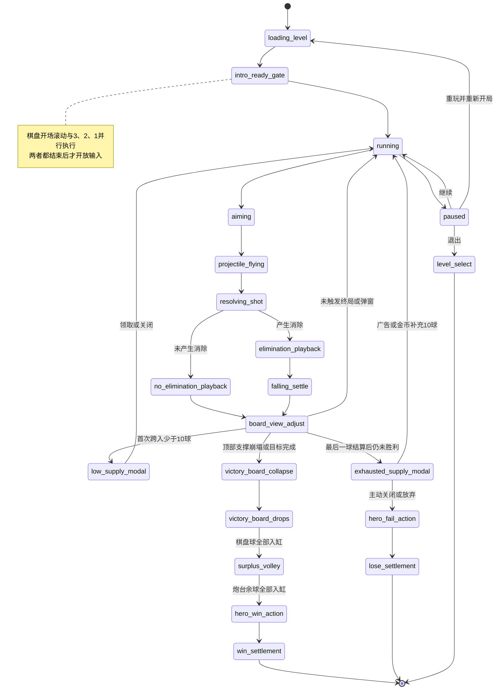

# 琉璃精灵泡泡玩法详细设计

> 文档状态：V1.0 详细设计稿  
> 日期：2026-06-20  
> 适用工程：Cocos Creator 2.4.9，`E:\coco_project\bubble`  
> 本文只定义目标玩法、数据契约和实施边界，不代表功能已经实现。

## 1. 设计目标

本次改造保留项目现有的蜂窝棋盘、发射吸附、三消、失去支撑掉落、缸体收集、特殊球和浮岛选关骨架，将局内核心体验改造成“清除顶部支撑—制造大面积坠落—借助琉璃精灵反弹—落缸倍率计分”的循环。

设计重点：

1. 去掉按发射次数强制下压棋盘的压迫机制，改为围绕 11 行可视棋盘自动滚动。
2. 强化玻璃球逐颗碎裂、悬空坠落、碰撞精灵、落缸计分的连续反馈。
3. 让局内主角精灵、可收集琉璃精灵、解救精灵和坏蛋精灵共享同一套世界观。
4. 把低剩余球、补球、胜负动作、余球抛射和弹道道具做成可验证的状态机，不靠 UI 延时猜测流程。
5. 沿用项目 Fail-Fast 原则：缺配置、缺节点、缺资源、非法状态直接报错，不添加默认值、静默跳过或旧逻辑兼容分支。

### 1.1 借鉴边界

可以借鉴经典泡泡消除产品的“发射—消除—坠落—底部接球—伙伴反弹加成”节奏，但角色名称、世界设定、美术造型、台词、关卡图案、音效和数值均使用本项目原创内容，不直接复刻《开心泡泡猫》的受保护素材与叙事表达。

### 1.2 模式适用范围

- 普通 `shot_limited` 关卡：应用本文全部棋盘、剩余球、补球、余球抛射与胜负流程。
- 特殊浮岛 `timed_infinite_shots` 关卡：应用棋盘滚动、消除、精灵碰撞和解救目标；不显示剩余球、不触发低球/零球补给、不执行炮台余球抛射。
- 随机挑战：复用普通关卡规则，但随机生成器必须同时满足“至少 7 行、顶部行填满、特殊实体合法”的新校验。

## 2. 世界观设计

### 2.1 世界背景

故事发生在漂浮于云海上的“琉璃浮岛群”。岛屿的能量来自会发光的琉璃球，琉璃球原本由精灵照看。反派“黯晶王”污染了岛心，把守护精灵封进球体，并用凝石魔法让浮岛逐层失去光芒。

“璃星公主”被困在浮岛群最深处。玩家操控引路精灵“米露”，利用琉璃炮台击碎污染球、解救小精灵，并沿特殊浮岛打开通向公主的逃离航路。

以上名称是可替换的工作名；更名只影响文案和资源命名，不改变系统规则。

### 2.2 角色与玩法映射

| 世界观对象 | 局内身份 | 玩法作用 |
|---|---|---|
| 米露（主角精灵） | 炮台旁的递球手 | 持有下一颗球，发射后把球装入炮台；负责胜利/失败动作 |
| 琉璃精灵 | 6 个场内协助位 | 被消除能量召唤，反弹坠落球并提高落缸倍率 |
| 被困小精灵 | 特殊球体 | 特殊关卡目标；打破封印或安全落缸即完成解救 |
| 凝石坏蛋精灵 | 棋盘特殊实体 | 被直接击中时固化周围球，制造短期障碍 |
| 璃星公主 | 长线剧情目标 | 玩家通过特殊浮岛逐段解锁逃离路线 |
| 黯晶王 | 主反派 | 污染琉璃球、操纵坏蛋精灵、封锁特殊浮岛 |

### 2.3 浮岛推进结构

- 普通浮岛：清理琉璃污染，积累星星和精灵能量。
- 特殊浮岛：配置“解救小精灵”目标；完成后该精灵加入玩家的协助精灵池。
- 章节节点：每解救一组精灵，恢复一段逃离航路并推进公主剧情。
- 终章：已解救精灵共同稳定琉璃炮台，帮助公主离开黯晶核心岛。

为了保持严格数据契约，启用琉璃精灵玩法前，玩家协助池必须至少包含一只基础精灵；首关剧情直接授予基础精灵，协助池为空应报错，不能临时生成匿名精灵兜底。

## 3. 核心玩法循环

一次标准操作循环：

1. 玩家拖动瞄准；普通状态只显示发射方向的第一段直线。
2. 主角把手中球装入炮台，炮台发射当前球，主角取出下一颗球等待。
3. 球命中并吸附到蜂窝格。
4. 若形成三消，逻辑层立即完成消除判定；表现层按吸附点向外逐颗碎裂。
5. 失去顶部支撑的球进入坠落系统。
6. 本次产生消除时，从最后一颗消除球的位置召唤一只琉璃精灵；未产生消除时，最早入场的两只协助精灵离场。
7. 坠落球可碰撞协助精灵，每次有效碰撞提高该球的落缸倍率，并提高被撞精灵的表面光效层数。
8. 球进入底部缸口，按缸位基础分、颜色加成、精灵碰撞倍率和局内分数增益结算。
9. 根据棋盘实际占用行调整视口，使屏幕中上方尽量维持 11 行。
10. 检查顶部支撑崩塌、解救目标、剩余球预警和零球补给。

## 4. 局内总状态机



### 4.1 输入锁定

以下阶段禁止瞄准、发射和使用局内道具：

- 棋盘开场滚动与 3、2、1 倒计时；
- 发射球飞行；
- 逐颗消除表现尚未结束；
- 坠落球仍可能改变目标进度；
- 棋盘视口正在自动上移/下移；
- 补球、暂停、胜负弹窗打开；
- 顶部清场、余球抛射、主角胜败动作。

输入锁必须来自 `GameManager` 的明确状态，不能只在按钮层禁用触摸。

## 5. 新棋盘视口系统

### 5.1 术语

- 逻辑行：关卡 `layout` 中的蜂窝行，行号不会因视口移动改变。
- 有效占用行：该行至少存在一个棋盘实体，包括普通球、特殊球、固化球、被困精灵或坏蛋精灵。
- 可视行：球体可视边界与 HUD 下沿、炮管安全线上沿之间的区域相交的逻辑行。
- 顶部线：逻辑第 0 行球体的上边缘。
- HUD 下沿：顶部 HUD 的局内安全边界。
- 炮管安全线：炮管口上方一行球体的最低允许边界。

“保持 11 行”按连续逻辑行跨度计算，不按非空行数量压缩；中间空行仍占一行高度。

### 5.2 权威数据

当前 `BubbleGrid.dropOffsetRows` 是整数，并同时承担初始化藏行、按回合下压和几何定位。新方案不继续复用这个多义字段：

- 新增 `BoardViewportSystem`，唯一持有连续像素量 `offsetY`、`targetOffsetY`、移动阶段和速度。
- `BubbleGrid` 只保存逻辑格与实体；`getCellPosition()` 必须使用同一份 `offsetY` 计算物理坐标。
- 碰撞预测、实际发射、特殊球动画、坠落起点和渲染都读取同一 runtime snapshot 中的 `boardViewport.offsetY`。
- 不保留 `dropOffsetRows` 兼容别名；迁移遗漏应由校验或运行时异常暴露。

这样可避免只移动渲染节点、但碰撞格仍停在旧位置的错位问题。

### 5.3 删除的旧规则

实现时删除以下业务路径：

- `dropInterval` 到期后调用 `_scheduleBoardAdvanceAfterImpact()`；
- `_updatePendingBoardAdvance()` 的按回合等待；
- `_advanceBoardIfNeeded()` 调用 `BubbleGrid.advanceRows(1)`；
- `_ensureMinimumVisibleBoardRows(6)` 的旧 6 行规则；
- 正常流程中的 `lost_danger` 棋盘下压失败判定。

特殊动画仍需等待，但等待目标改为“本次消除/掉落/视口调整完成”，不再等待旧棋盘下压。

### 5.4 开局定位与倒计时

1. 载入关卡后，先计算棋盘最低实体行。
2. 若配置行数大于 11 行，将最低一行球体的下边缘对齐到炮管安全线；这是开场初始位置。
3. 棋盘以恒定 `320 px/s` 向上移动，直到屏幕中只保留 11 行。
4. 若配置行数不大于 11 行，直接计算正常目标位置，不播放长距离滚动。
5. 屏幕中央同时播放 `3 → 2 → 1 → GO`，3、2、1 各 `0.75s`，GO 为 `0.35s`。
6. 开场滚动与倒计时是两个并行门：只有二者都结束后才能操作。若滚动先结束则等倒计时；若倒计时先结束则等滚动。

### 5.5 每次结算后的目标位置

结算完成后统一调用 `BoardViewportSystem.planSettle(boardSnapshot)`：

1. 计算当前顶部占用行、底部占用行和可视跨度。
2. 可视跨度少于 11 且顶部仍有隐藏行时，棋盘向下缓动，补足到 11 行。
3. 向下移动时，逻辑第 0 行顶部一旦到达 HUD 下沿立即停止，不能把顶部行压到 HUD 下方。
4. 发射球吸附后导致可视跨度大于 11 时，棋盘向上移动，直到恢复 11 行。
5. 棋盘只有 7～10 行时，不制造不存在的行；顶部线到 HUD 下沿后保持实际行数。
6. 下移采用 `easeOutCubic`，建议 `0.22s + 0.08s × 移动行数`，上限 `0.70s`。
7. 普通结算上移采用同样缓动；只有开场大棋盘上移使用匀速。

目标位置计算必须是纯函数；相同棋盘快照必须得到相同目标位置，便于 Node 校验脚本复现。

## 6. 吸附、三消与逐颗碎裂

### 6.1 逻辑顺序

1. 发射球抵达目标格并写入 `BubbleGrid`。
2. 坏蛋精灵“直接命中”技能先生成固化状态，但本次新生成的固化不能被同一次消除解除。
3. `MatchSystem` 从吸附球开始查找同色连通组；固化球、石头球、锁定球和精灵实体不参与颜色连通。
4. 连通数量达到 3 时，匹配球立即从逻辑棋盘移除。
5. 处理钥匙、分裂球、燃烧瓶、冰球等已有反应实体。
6. 计算失去支撑的实体并从棋盘移除，注册到 `FallingMarbleSystem`。
7. 生成确定性的表现序列和逐球分数事件。

“立即消除”指业务状态不等待每颗球动画后才决定结果；表现层仍按序播放，期间输入保持锁定。

### 6.2 扩散顺序

- 第 0 个：本次吸附球。
- 其余球：按六边格到吸附球的 BFS 距离分环。
- 同一距离内：按屏幕顺时针排序；角度相同时按 `row`、`col` 升序。
- 特殊连锁产生的新消除批次排在当前批次之后，每个批次仍按自身触发点扩散。
- `resolution.eliminationSequence[]` 每项包含 `cellId`、`row`、`col`、`worldPosition`、`removeType`、`points`、`delayMs`。

建议每颗间隔 `55ms`，单批总延时上限 `650ms`；超过上限时按球数等比压缩间隔，但顺序不变。

### 6.3 音效与分数表现

- 每颗匹配球碎裂播放玻璃碎裂短音，首颗音量最高，后续按固定的 3 档音高轮换，避免随机结果不可复现。
- 每颗球消除时在原位置生成 `+分数` 数字 Sprite/BMFont。
- 数字在 `0.55s` 内上飘 `70px`、轻微放大并渐隐。
- 逻辑分数在结算时一次性写入；飘字只是 `scoreEvents[]` 的表现，不反向修改分数。
- 悬空球的棋盘移除分与最终落缸分分开记录，防止重复或漏计。

### 6.4 未产生消除

当 `matched + reactiveRemoved + blastRemoved == 0` 时认定为未产生消除：

- 连击清零；
- 发送 `shot_no_elimination` 事件；
- 按入场序号从旧到新移除最多两只场上琉璃精灵；
- 若当前只有一只则移除一只，没有则只记录事件；
- 完成精灵离场和棋盘上移后再恢复输入。

## 7. 琉璃精灵协助系统

### 7.1 六个固定位置

场内固定 6 个协助位，左右镜像排列在棋盘下方到缸口上方的坠落区。位置使用坠落区宽高比例表达，不写死世界坐标：

| 槽位 | X/半宽 | Y/区域高度 | 说明 |
|---|---:|---:|---|
| 0 | -0.72 | 0.78 | 左上 |
| 1 | -0.42 | 0.55 | 左中 |
| 2 | -0.16 | 0.32 | 左下 |
| 3 | 0.16 | 0.32 | 右下 |
| 4 | 0.42 | 0.55 | 右中 |
| 5 | 0.72 | 0.78 | 右上 |

每个槽位必须有唯一碰撞圆、显示锚点和飞入锚点。槽位重叠、超出坠落区或缺节点直接报错。

### 7.2 生成与入位

- 本次产生消除时，从 `eliminationSequence` 最后一项的位置生成一个琉璃光团。
- 光团沿二次贝塞尔曲线飞往目标槽位，飞行 `0.45s`。
- 有空槽时选择编号最小的空槽。
- 6 槽全满时，新精灵替换“加成等级最低”的精灵；等级相同则替换入场最早者。旧精灵先飞离，新精灵再入位。
- 精灵外观从玩家已解锁协助池中按本次关卡配置选择，不能从空池随机兜底。

### 7.3 精灵等级

初版建议按本次消除规模决定生成等级：

| 本次被移除总数（匹配 + 悬空） | 精灵等级 | 每次有效碰撞给该球增加的倍率 |
|---:|---:|---:|
| 3～5 | 1 | `+1` |
| 6～9 | 2 | `+2` |
| 10 及以上 | 3 | `+3` |

该表放入 `FairyAssistConfig.js`，必须完整配置所有区间，不在代码中写默认等级。

### 7.4 坠落碰撞

- 只处理 `FallingMarbleSystem` 中的动态球；正在瞄准或飞行的发射球不与精灵碰撞。
- 棋盘悬空球和胜利阶段炮台余球都可以碰撞精灵。
- 每颗坠落球对同一只精灵最多产生一次计分碰撞，防止卡在碰撞体内重复刷分。
- 每次有效碰撞后按圆形碰撞法线反射速度，并乘 `0.82` 阻尼，同时给予最小向上速度，保证反馈清晰。
- 坠落球保存 `hitFairyIds[]`、`fairyBonusSteps` 和 `finalMultiplier`。
- 初始倍率为 `1`；碰撞 1 级、2 级、3 级精灵后分别累加 1、2、3。例如依次碰撞 1 级和 3 级，最终倍率为 `1 + 1 + 3 = 5`。
- 石头球可以发生物理反弹和点亮精灵，但最终得分始终为 0。

### 7.5 表面光效

- 每次有效碰撞，目标精灵 `glowStacks += 1`。
- 不实际创建一层新 Sprite；使用一张光效 Sprite 配合材质参数或序列帧表达层数，避免碰撞次数增加 draw call。
- 精灵离场或被替换时清空其光效层数。
- 光效层数只影响表现，不再次乘分。

## 8. 主角递球与炮台重设计

### 8.1 主角动画状态

| 状态 | 触发 | 结束条件 |
|---|---|---|
| `idle_hold` | 可操作且手中有下一球 | 玩家开始发射 |
| `load_ball` | 当前球离开炮口 | 手中球移动到炮口并成为新当前球 |
| `fetch_next` | 装填完成 | 新下一球出现在手中 |
| `cheer` | 所有棋盘球和余球完成入缸 | 胜利动画时长结束 |
| `sad` | 玩家放弃补球或其它失败成立 | 失败动画时长结束 |

主角只展示 `ShooterController` 已经确定的球队列，不能自行随机生成球。

### 8.2 装填时序

1. 发射前：当前球在炮口，下一球在主角手中。
2. 当前球发射：主角立即进入 `load_ball`。
3. 手中球用 `0.22s` 贝塞尔动画移动到炮口。
4. `ShooterController.advanceQueue()` 在发射瞬间已完成业务队列推进；动画只是同一快照的可视化。
5. 装填完成后，主角从背包/光团中取出新的下一球并进入 `idle_hold`。

### 8.3 炮台视觉与节点契约

炮台改为独立基座、可旋转炮管和剩余球显示：

```text
ShooterPanel
├─ ShooterBase
│  ├─ BaseSprite
│  ├─ RemainingShots
│  └─ CriticalGlow
├─ BarrelPivot
│  ├─ BarrelSprite
│  ├─ CurrentBallAnchor
│  └─ MuzzleAnchor
├─ HeroRoot
│  ├─ HeroAnimation
│  └─ HeldBallAnchor
└─ NextBallFx
```

- `RemainingShots` 写在基座正面，正常为白色。
- 剩余球 `<10` 时数字变红。
- 剩余球 `<5` 时显示 `CriticalGlow`，从 `0.8` 到 `1.25` 循环放大并淡入淡出。
- 无限球模式显示“∞”，不触发红字和光效。
- 缺任一必需节点、Label/BMFont、动画或 SpriteFrame 直接报错。

## 9. 瞄准线与“显示反弹线”道具

### 9.1 普通状态

- `TrajectoryPredictor` 仍计算完整真实弹道，物理反弹行为不改变。
- 普通显示只取 `pathPoints` 的第一段，画到第一次撞墙、撞球或顶部命中点。
- 若第一段直接命中球或顶部，可显示最终幽灵球。
- 若第一段撞墙，隐藏墙后路径和最终幽灵球，避免间接泄露反弹落点。

### 9.2 道具状态

- 新道具 ID：`ricochet_guide`，中文名“反弹预览”。
- 使用后在当前尝试内设置 `ricochetGuideActive = true`，直到本局胜利、失败、退出或重玩。
- 激活时显示全部预测反弹段和最终幽灵球。
- 重玩属于新尝试，必须重新消耗道具；退出不返还已使用道具。
- 道具只改变显示策略，不提高 `TrajectoryPredictor.maxBounces`，也不改变实际碰撞。

## 10. 缸口分值与坠落物理

### 10.1 基础分显示

沿用当前最多 4 个缸口的结构，每个缸口上方显示基础掉入分，越靠近屏幕中心越高：

| 缸数量 | 从左到右基础分 |
|---:|---|
| 1 | `[120]` |
| 2 | `[80, 80]` |
| 3 | `[60, 120, 60]` |
| 4 | `[40, 90, 90, 40]` |

这些数值是首版建议，应集中在 `JarScoreConfig.js`，禁止根据数组缺失自动推导。

### 10.2 最终计分公式

```text
普通球落缸分 = round(缸位基础分 × 同色缸倍率 × 琉璃精灵倍率 × 临时分数增益)
石头球落缸分 = 0
```

- 同色缸倍率沿用关卡 `jarRules.sameColorBonus`。
- 琉璃精灵倍率来自该球实际有效碰撞。
- 分数增益沿用已有局内增益系统。
- `jar_collect_scored` 事件必须携带每颗球的基础分、各倍率、最终分和缸位，不能只携带聚合总分。

### 10.3 降低重力

当前坠落系统重力为 `2200`。首版建议改为：

- `gravity: 900`
- `initialSpeedY: 120`
- `horizontalSpeed: 165`
- `maxDropLifeTime: 6.0s`
- 墙体反弹阻尼 `0.82`

降低重力后必须同步延长最大生命周期，否则慢速球会在到达缸口前被强制结算。最终数值以真机“从棋盘中部到缸口约 1.4～1.8 秒”为验收目标。

## 11. 顶部崩塌、胜利与余球抛射

### 11.1 顶部行规则

- 关卡生成时逻辑第 0 行必须填满所有合法列。
- “填满”包括普通球或合法特殊实体占位；`.` 且没有 `specialEntities` 占位视为空格。
- 分裂球继续禁止放在顶部行；被困小精灵和坏蛋精灵是否允许在顶部行由各实体配置明确声明。
- 任意有效关卡 `layout.length >= 7`。

### 11.2 崩塌触发

每次完整结算后，按以下顺序判断：

对于 `completionPolicy: anchor_collapse` 的普通关卡，现有收集目标全部完成时可以提前进入胜利崩塌；即使收集目标尚未完成，下面第 2、3 条结构条件成立也属于“直接胜利”。对于 `completionPolicy: rescue_fairy` 的解救关卡，结构崩塌会把剩余被困精灵送入缸内，但最终仍必须完成全部解救目标。

1. 统计仍连接到逻辑第 0 行的顶部支撑球数量。
2. 顶部支撑球数量 `<=5` 时，触发整个剩余棋盘崩塌。
3. 即使顶部球多于 5，只剩逻辑顶部一行时也直接触发崩塌。
4. 触发后把棋盘上所有剩余球注册为 `victory_board_drop`，不再允许发射。
5. 普通关卡在这些球全部入缸后成立胜利；解救关卡还必须在入缸过程中完成全部解救目标。

“顶部支撑球”不包含已移除球；固化球、锁定球、石头球、被困精灵和坏蛋精灵只要仍占据顶部行都计入数量。

### 11.3 顶部球入缸

- 胜利崩塌球继续使用低重力和精灵碰撞。
- `victory_board_drop` 必须有确定性缸口目标，确保全部进入缸内；不得进入 missed 分支。
- 所有顶部球完成入缸前，不能启动炮台余球抛射。
- 石头球进入缸内仍为 0 分。

### 11.4 炮台余球逐颗抛射

棋盘球全部入缸后，排空 `ShooterController` 中与 `remainingShots` 等量的余球：

1. 用本局随机种子决定首轮从 `-30°` 还是 `+30°` 开始。
2. 角度每次移动 `15°`。
3. 示例序列：`-30, -15, 0, 15, 30, 15, 0, -15, -30...`；从右开始则镜像。
4. 炮管先用 `0.12s` 旋转到目标角，再发射一颗球。
5. 每颗间隔 `0.18s`，直到余球队列为空。
6. 每颗余球按真实抛物线进入坠落系统，可碰撞琉璃精灵并落缸计分。
7. 余球全部入缸后，主角播放胜利动作；动作结束才弹胜利结算。

当前 `registerSurplusShotsFromOrigin()` 每帧批量随机抛射的实现需改成受角度序列控制的单球队列，不能在渲染层伪造炮管旋转。

## 12. 剩余球预警与补球

### 12.1 少于 10 球

- 在一次发射完整结算且确认未胜利后，检测剩余球是否从 `>=10` 跨到 `<10`。
- 每次关卡尝试只主动弹出一次低球补给弹窗。
- 弹窗提供“看广告 +10 球”和关闭；关闭后继续游戏。
- 广告完整播放后才增加 10 球；广告失败显示明确错误并保持弹窗，不赠送球。
- 若关卡开局配置本身少于 10 球，倒计时结束后立即触发一次。

### 12.2 剩余球为 0

最后一球必须先完成吸附、消除、掉落、目标和胜利判断；只有确认仍未胜利后才弹零球补给弹窗：

- 选项一：看广告，补充 10 球。
- 选项二：消耗金币，补充 10 球；首版建议价格为 300 金币，最终由数值配置确认。
- 主动关闭、点击放弃或返回键关闭都进入失败流程。
- 金币不足只提示不足并保持弹窗；不能免费补球或自动切广告。
- 广告失败保持弹窗；不能自动改走金币。
- 同一次尝试允许多次到 0 后购买/观看，但每次必须重新付费或完整看完广告。

建议新增 `ShotSupplyPolicy.js` 统一生成弹窗模式、奖励数量、金币价格和允许操作，避免广告与金币分支分别修改 `remainingShots`。

## 13. 道具说明入口

- 底部道具 UI 增加固定 `InfoBtn`，不占用道具槽位。
- 点击打开 `PowerupHelpView`，展示图标、名称、作用范围、使用时机和“本局/单次”消耗规则。
- 必须包含新增“反弹预览”道具说明。
- 说明弹窗打开时暂停局内计时、瞄准和坠落更新；关闭后恢复原状态。

弹窗遵守 Sprite 代理分层：

- 原始 item/prefab 嵌套保留为布局、点击和编辑入口；
- 相同图集/材质的 Sprite 在独立代理渲染层集中绘制；
- 原始 Sprite 关闭渲染，不能与代理重复绘制；
- 名称和短说明优先 BMFont/独立文本层；
- 缺节点、SpriteFrame、尺寸或层级时直接报错。

## 14. 暂停弹窗

暂停入口独立于设置弹窗，只有三个功能：

1. 重玩
2. 继续
3. 退出

### 14.1 生命规则

- 进入当前关卡时已经提交并消耗 1 条生命，暂停退出不再额外扣第 2 条，但当前已消耗生命不返还。
- 点击重玩会开始一次新尝试，因此再消耗 1 条生命。
- 继续不消耗生命。
- 重玩确认文案：“重玩将结束本局并再消耗 1 条生命，是否继续？”
- 退出确认文案：“退出将结束本局，本局已消耗的 1 条生命不会返还，是否退出？”
- 生命不足时禁止重玩并明确提示；退出仍可执行。

### 14.2 暂停范围

暂停时冻结：主角动画、发射球、逐颗消除计时、坠落物理、棋盘缓动、倒计时、精灵飞入/离场和局内计时器。继续后从同一帧状态恢复，不能重新计算一次结算。

暂停、补给、道具说明等新弹窗都使用 Sprite 代理分层；三个按钮的原节点保留 `cc.Button` 和点击区域。

## 15. 被困小精灵特殊球

### 15.1 数据定义

新增：

```json
{
  "id": "rescue_fairy_001",
  "entityCategory": "rescue_fairy_ball",
  "entityType": "sealed",
  "fairyId": "fairy_wind_01",
  "row": 4,
  "col": 3
}
```

新增胜利目标：

```json
{ "type": "rescue_fairy", "value": 3 }
```

### 15.2 解救规则

- 被困精灵球不参与颜色三消，但参与支撑。
- 相邻的颜色消除、爆炸/燃烧等合法特殊效果击中封印时，封印破碎，精灵飞往目标 HUD，计为解救 1 只。
- 因失去支撑而坠落时，只有成功进入缸内才计为解救；missed 不计。
- 同一 `fairyId` 只能计数一次。
- 达到 `rescue_fairy` 目标后触发剩余棋盘胜利崩塌。
- 特殊浮岛结算后将配置指定的精灵写入玩家已解锁协助池。

## 16. 坏蛋精灵与固化状态

### 16.1 数据定义

```json
{
  "id": "enemy_fairy_001",
  "entityCategory": "enemy_fairy",
  "entityType": "petrifier",
  "skill": "solidify_neighbors",
  "row": 5,
  "col": 4
}
```

### 16.2 直接命中

- “直接命中”指 `shotPlan.collidedCell.id` 是该坏蛋精灵；仅吸附到其邻格但没有碰撞不触发。
- 发射球仍按正常规则寻找邻近吸附格。
- 技能目标是坏蛋精灵周围最多 6 个当前存在且可固化的邻居球。
- 石头、锁定球、其它坏蛋精灵和已经固化的球不可再次固化。
- 没有合法邻居时仍记录技能触发与空目标结果，不能改选更远目标。

### 16.3 固化规则

- 固化球保留原颜色和实体数据，增加 `solidified` 状态、来源坏蛋 ID 和创建结算序号。
- 固化球不可参与或被颜色三消，但可以成为新球的吸附邻居，并继续提供支撑。
- 在固化产生之后的下一次“棋盘中产生消除”完成时，自动解除所有固化状态。
- 同一次直接命中如果随后形成三消，不解除刚创建的固化；必须等待下一次消除操作。
- 固化球若失去顶部支撑，先解除固化表现，再作为原始球进入坠落系统。
- 坏蛋精灵本体不参与三消；失去支撑时直接掉落并离场，不产生普通球落缸分。

`MatchSystem`、`SupportSystem` 和 `FallingMarbleSystem` 必须分别处理“不可匹配、仍可支撑、失撑可掉落”三个维度，不能只靠一个 `entityType` 条件混在一起。

## 17. 胜利与失败动作

### 17.1 胜利

严格顺序：

1. 顶部崩塌或目标完成。
2. 棋盘剩余球全部入缸并完成计分。
3. 炮台余球逐颗抛射并全部入缸。
4. 主角播放 `cheer`。
5. `cheer` 完成后进入 `won` 并打开 WinView。

### 17.2 失败

严格顺序：

1. 零球补给弹窗被关闭/放弃，或其它明确失败条件成立。
2. 关闭补给弹窗并锁定输入。
3. 主角播放 `sad`。
4. `sad` 完成后进入最终失败态并打开 LoseView。

主角动画时长写入共享 `SpecialAnimationTiming.js`，`GameManager` 和渲染层共同读取；不能分别写两个延时常量。缺动画或时长非法直接报错。

## 18. 配置与校验设计

### 18.1 建议新增配置模块

- `BoardViewportConfig.js`：11 行、7 行下限、顶部 5 球阈值、HUD/炮管边界、滚动速度与缓动。
- `FairyAssistConfig.js`：六槽位置、精灵等级、碰撞半径、反弹参数。
- `JarScoreConfig.js`：1～4 缸基础分表。
- `ShotSupplyConfig.js`：10/5 阈值、+10 奖励、金币价格、每局低球弹窗次数。
- 扩展 `SpecialAnimationTiming.js`：消除间隔、精灵飞入/离场、炮管旋转、主角胜败动作。

这些配置字段全部必填并在模块加载时验证，不允许使用 `|| 默认值`。

### 18.2 关卡数据升级

本次属于玩法语义变更，建议把关卡 schema 升为 2，并一次性迁移本地 1～10 关、远程 11～1000 关、compact codec、manifest 和离线表。Schema 2 至少增加：

- `completionPolicy`: `anchor_collapse` 或 `rescue_fairy`
- `winConditions` 支持 `rescue_fairy`
- `specialEntities` 支持 `rescue_fairy_ball/sealed`、`enemy_fairy/petrifier`
- 顶部行有效占位校验
- `layout.length >= 7`

不在运行时兼容 schema 1；未迁移数据应在 `LevelConfigLoader` 直接失败。

### 18.3 示例关卡片段

```json
{
  "schemaVersion": 2,
  "coordinateSystem": "odd-r-hex",
  "level": {
    "levelId": 101,
    "code": "L101_FAIRY_RESCUE",
    "levelType": "special_floating_island",
    "playMode": "timed_infinite_shots",
    "completionPolicy": "rescue_fairy",
    "layout": [
      "RGBYPRGBY",
      "GBYPRGBY",
      ".........",
      "........",
      ".........",
      "........",
      "........."
    ],
    "winConditions": [
      { "type": "rescue_fairy", "value": 1 }
    ],
    "specialEntities": [
      {
        "id": "rescue_fairy_001",
        "entityCategory": "rescue_fairy_ball",
        "entityType": "sealed",
        "fairyId": "fairy_wind_01",
        "row": 3,
        "col": 3
      },
      {
        "id": "enemy_fairy_001",
        "entityCategory": "enemy_fairy",
        "entityType": "petrifier",
        "skill": "solidify_neighbors",
        "row": 5,
        "col": 4
      }
    ]
  }
}
```

示例只展示新增字段；正式关卡仍必须包含颜色、发球数、罐子、分数、广告道具等现有必填字段。

### 18.4 生成器与校验器

必须同时修改：

- `assets/scripts/config/LevelConfigLoader.js`
- `assets/scripts/config/LevelPackCompactCodec.js`
- `tools/generate-1000-level-configs.js`
- `tools/validate-level-content.js`
- `tools/validate-level-sync.js`
- `tools/validate-random-challenge.js`
- `assets/scripts/editor/MapEditor*` 的实体编辑与导出

新增离线断言：

1. 行数至少 7。
2. 顶部行每个合法格都有普通球或特殊实体。
3. 顶部行不允许分裂球。
4. `rescue_fairy` 目标值不超过关卡内唯一被困精灵数量。
5. 坏蛋精灵周围坐标合法且不与其它实体重叠。
6. 特殊实体 ID、`fairyId` 唯一。
7. 远程 compact 包展开后与本地规范化结果一致。

## 19. 代码改造边界

### 19.1 Core / Systems

| 模块 | 改造职责 |
|---|---|
| `GameManager.js` | 新总状态机、倒计时门、补球门、胜败动作等待、运行时事件 |
| `GameManagerShotResolutionMethods.js` | 移除旧下压；输出消除序列；顶部崩塌；坏蛋固化时序；精灵生成/离场事件 |
| `BubbleGrid.js` | 去掉整数下压语义；提供逻辑行统计、顶部支撑统计和统一视口坐标 |
| 新 `BoardViewportSystem.js` | 计算/更新连续视口位移，管理开场匀速与结算缓动 |
| `MatchSystem.js` | 排除固化球与非颜色实体，保持三消从吸附球开始 |
| `SupportSystem.js` | 固化球仍参与支撑；坏蛋/被困精灵按实体规则处理 |
| `FallingMarbleSystem.js` | 低重力、精灵碰撞、逐球倍率、胜利球必入缸、按角度逐颗余球抛射 |
| `JarCollectorSystem.js` | 记录每球缸位基础分、倍率拆分、石头 0 分、解救球进缸 |
| `ShooterController.js` | 暴露当前球/手持下一球/余球队列；支持逐颗余球排空 |
| `TrajectoryPredictor.js` | 真实弹道保持完整，向渲染层提供第一撞墙点和完整路径 |
| 新 `FairyAssistSystem.js` | 六槽、等级、入场顺序、碰撞去重、光效层数与 snapshot |
| 新 `ShotSupplyPolicy.js` | 低球/零球补给资格和奖励计划 |

### 19.2 Bootstrap / UI

| 模块 | 改造职责 |
|---|---|
| `GameBootstrapGameplayInputMethods.js` | 按核心状态锁输入；调用反弹预览道具 |
| `GameBootstrapLevelRuntimeMethods.js` | 重玩生命语义、退出流程、新终态集合 |
| `GameBootstrapPowerupInventoryMethods.js` | 新道具库存与当局消耗 |
| `GameBootstrapAdRewardMethods.js` | +10 球广告奖励，不直接改状态 |
| 新 `ShotSupplyViewController.js` | 低球/零球两种弹窗模式 |
| 新 `PowerupHelpViewController.js` | 道具说明和 Sprite 代理列表 |
| 新 `PauseViewController.js` | 重玩、继续、退出与确认文案 |

### 19.3 Render / Prefab

| 模块 | 改造职责 |
|---|---|
| `LevelRendererSceneMethods.js` | 逐球碎裂/飘字、直线/反弹线显示、炮台、倒计时、缸分数、主角动作 |
| 建议拆出 `LevelRendererFairyMethods.js` | 六槽精灵、飞入/离场、碰撞/光效表现 |
| `GameView.prefab` | 新棋盘视口根、精灵层、主角炮台、缸分数层、倒计时层 |
| 新 UI prefabs | 补球、道具说明、暂停弹窗，全部遵守 Sprite 代理分层 |

如果实际实施新增以上模块或改变主要运行链路，完成代码时必须同步更新根目录 `PROJECT_STRUCTURE.md`。

## 20. 关键运行时数据

`getRuntimeSnapshot()` 建议新增：

```javascript
{
  state: "running",
  inputLocked: false,
  boardViewport: {
    phase: "idle",
    offsetY: 0,
    targetOffsetY: 0,
    visibleRowSpan: 11
  },
  countdown: {
    active: false,
    value: 0
  },
  fairies: {
    slots: [],
    activeCount: 0
  },
  shooter: {
    currentBall: {},
    heldNextBall: {},
    ricochetGuideActive: false,
    surplusVolley: null
  },
  supply: {
    lowSupplyPromptShown: false,
    pendingMode: null
  },
  lastResolution: {
    eliminationSequence: [],
    scoreEvents: [],
    spawnedFairy: null,
    departedFairies: [],
    solidifiedCells: [],
    releasedSolidifiedCells: []
  }
}
```

所有数组和对象在状态创建时显式初始化；读取方不使用 `|| []` 或 `?? 默认值` 掩盖缺字段。

## 21. 事件清单

建议新增或替换以下 runtime event：

- `intro_board_scroll_started/finished`
- `countdown_tick/finished`
- `shot_elimination_started/finished`
- `glass_ball_shattered`
- `elimination_score_popup`
- `shot_no_elimination`
- `fairy_spawned/departed/collided/glow_changed`
- `board_view_move_started/finished`
- `top_anchor_collapse_started`
- `victory_board_drops_finished`
- `surplus_volley_started/shot_fired/finished`
- `low_supply_prompt_requested`
- `exhausted_supply_prompt_requested`
- `shots_supplied`
- `hero_win_action_started/finished`
- `hero_fail_action_started/finished`
- `rescue_fairy_completed`
- `enemy_fairy_skill_triggered`
- `cells_solidified/solidification_released`

每个事件带单调递增 ID；渲染层按 ID 去重，不能依赖数组内容碰巧不同。

## 22. 实施阶段

### 阶段 A：数据与棋盘基础

1. 增加配置模块和 schema 2。
2. 迁移 1000 关与远程包。
3. 增加 7 行、顶部填满和新实体校验。
4. 实现 `BoardViewportSystem`，移除旧按回合下压。
5. 加入开场滚动和 3、2、1 输入门。

### 阶段 B：消除、坠落和精灵倍率

1. 输出确定性逐球消除序列和飘分事件。
2. 调低重力并延长生命周期。
3. 实现六槽琉璃精灵、生成/离场和碰撞倍率。
4. 实现缸口基础分和石头 0 分。

### 阶段 C：胜利演出与炮台

1. 实现顶部 5 球/只剩顶部行崩塌。
2. 改造余球为按角度逐颗抛射。
3. 重做炮台与剩余球数字警告。
4. 接入主角递球、胜利、失败动作。

### 阶段 D：道具和弹窗

1. 实现反弹预览道具。
2. 道具说明入口和代理弹窗。
3. 低于 10 球主动广告弹窗。
4. 0 球广告/金币补球弹窗。
5. 三功能暂停弹窗与生命规则。

### 阶段 E：特殊精灵内容

1. 被困小精灵与解救目标。
2. 坏蛋精灵与固化状态。
3. 特殊浮岛奖励、协助池和公主剧情串联。
4. 编辑器支持、关卡投放和完整回归。

各阶段完成后必须单独可验证，不能把新旧棋盘下压同时留在运行时等待最后切换。

## 23. 测试与验收

### 23.1 自动校验

在现有脚本基础上扩展：

- `npm run validate:levels`
- `npm run validate:level-sync`
- `npm run validate:random-challenge`
- `npm run validate:aim`
- `npm run validate:shots`

建议新增 `validate:fairy-gameplay`，覆盖纯系统级用例。

### 23.2 必测用例

1. 7 行关卡可加载，6 行关卡直接失败。
2. 顶部行任意空格且无特殊实体占位时直接失败。
3. 11 行关卡不做多余开场滚动；12、20 行关卡最终均显示 11 行。
4. 消除底部后向下补足到 11 行，顶部线到 HUD 下沿后停止。
5. 吸附导致第 12 行可见时棋盘上移一行且弹道/碰撞同步。
6. 三消从吸附球向外按固定顺序播放，每颗位置显示对应分数。
7. 未消除时按最老顺序离场两只精灵。
8. 6 槽满后按最低等级、最老顺序替换。
9. 同一坠落球重复接触同一精灵只计一次。
10. 石头球碰撞精灵、进入中心缸后仍为 0 分。
11. 顶部支撑为 6 时不崩塌，为 5 时全盘崩塌。
12. 只剩顶部一行且超过 5 球时仍崩塌。
13. 棋盘胜利球未全部入缸前不抛射余球。
14. 余球角度以 15° 往返，数量与原剩余球完全一致。
15. 余球全部入缸后先播主角胜利动作，再开 WinView。
16. 剩余球从 10 到 9 只主动弹一次低球广告弹窗。
17. 最后一球触发胜利时不弹零球补给。
18. 零球补给关闭后先播失败动作，再开 LoseView。
19. 广告失败不赠球，金币不足不关闭弹窗。
20. 普通瞄准在撞墙处截断；使用反弹预览后显示完整路径。
21. 重玩消耗新生命；退出不额外扣生命但不返还当前生命。
22. 坏蛋精灵直接命中固化邻居；同次三消不解除，下一次消除解除。
23. 固化球失去支撑后解除固化并正常掉落。
24. 被困精灵通过破封或安全落缸各计一次，重复事件不重复计数。
25. 暂停恢复后物理、动画和计时从同一状态继续。

### 23.3 性能与表现验收

- 微信真机持续 60 FPS 目标，低端机不因逐球飘字和精灵光效产生持续节点增长。
- 精灵光效层数使用材质参数/帧状态，不按碰撞次数新建 Sprite。
- 高频数字使用数字 Sprite 或 BMFont。
- 新弹窗相同图集 Sprite 通过代理层集中渲染，源 Sprite 禁用。
- 关卡退出后精灵、飘字、倒计时、余球和弹窗节点池数量回到稳定值。

## 24. 需求覆盖矩阵

| 原需求 | 落地章节 | 主要实现点 |
|---:|---|---|
| 1 | 5 | 删除按回合下压，11 行视口自动上下移动 |
| 2 | 6 | 吸附三消立即结算、玻璃碎裂、悬空掉落 |
| 3 | 7 | 消除召唤、未消除离场、6 槽碰撞倍率和光效 |
| 4 | 8 | 主角递球、装填、队列同步 |
| 5 | 9 | 默认直线、反弹预览道具当局生效 |
| 6 | 10 | 中心高、两侧低的缸口基础分 |
| 7 | 11、17 | 顶部清场、等待入缸、余球 15° 往返抛射 |
| 8 | 8 | 炮台重做、剩余球写在基座 |
| 9 | 13 | 底部道具说明入口 |
| 10 | 14 | 重玩、继续、退出与生命提示 |
| 11 | 10 | 重力 2200 降至建议 900，生命周期同步调整 |
| 12 | 11、18 | 最低 7 行，运行时和离线双校验 |
| 13 | 11 | 顶部支撑球不超过 5 时全盘崩塌 |
| 14 | 11、18 | 顶部行必须有效填满 |
| 15 | 5 | 大棋盘开场匀速上移、3/2/1 双门锁输入 |
| 16 | 6 | BFS 扩散消除、逐球飘分 |
| 17 | 12 | 首次少于 10 球主动广告 +10 |
| 18 | 11、17 | 全部入缸后主角胜利动作再结算 |
| 19 | 8 | 少于 10 红字、少于 5 循环光效 |
| 20 | 17 | 主角失败动作后再弹失败页 |
| 21 | 2 | 特殊浮岛解救精灵、协助公主逃离 |
| 22 | 15 | 被困小精灵球和解救目标 |
| 24 | 7、10 | 石头球可碰撞但落缸 0 分 |
| 25 | 12 | 0 球广告/金币 +10，关闭进入失败 |
| 26 | 16 | 坏蛋精灵直接命中固化、次次消除解除、失撑掉落 |

## 25. 首版待确认数值

以下不影响架构，可以在实现前或首轮真机试玩后调整：

| 参数 | 首版建议 |
|---|---:|
| 开场棋盘匀速上移 | 320 px/s |
| 消除逐颗间隔 | 55 ms |
| 坠落重力 | 900 |
| 坠落初始纵向速度 | 120 |
| 低球阈值 | `<10` |
| 强提醒阈值 | `<5` |
| 补球数量 | 10 |
| 金币补球价格 | 300 |
| 精灵等级加成 | +1 / +2 / +3 |
| 余球炮管角度 | -30°～+30°，每次 15° |
| 余球发射间隔 | 0.18 s |

除本表数值外，核心规则已经在本文中确定；实现阶段不应自行增加兜底、旧逻辑兼容或额外胜负分支。
